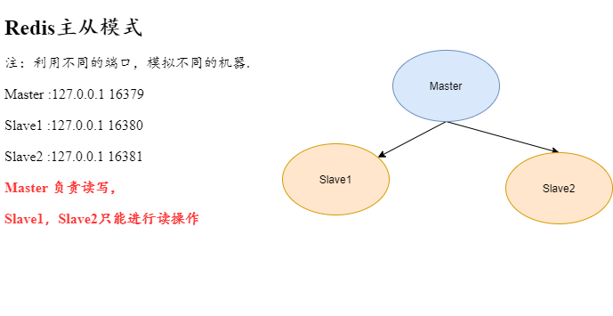

# Redis常见的集群模式
## 主从复制-[实际生产中基本不用]


### 环境搭建：
#### 下载 Redis实例到本地
```shell script
wget  http://download.redis.io/releases/redis-5.0.8.tar.gz
```
##### 解压
```shell script
tar -zxvf redis-5.0.8.tar.gz
```
#### 设置 Redis 环境变量
【这一步不设置也可以，但就需要到redis安装目录下去执行命令】
```shell script
  vi /etc/profile
```
增加如下内容：
```shell
    export REDIS_HOME=/software/redis-5.0.8
    export PATH=$PATH:$REDIS_HOME/bin
```
#### 创建文件夹
```shell script
    mkdir /usr/local/redis-master-slave
    cd /usr/local/redis-master-slave
    mkdir {16379,16380,16381}
```
#### 复制 redis.conf 到各个文件夹下
```shell script
   cp /software/redis-5.0.8/redis.conf /usr/local/redis-master-slave/16379/
   cp /software/redis-5.0.8/redis.conf /usr/local/redis-master-slave/16380/
   cp /software/redis-5.0.8/redis.conf /usr/local/redis-master-slave/16381/
```

#### 分别编辑[16379,16380,16381]目录下的redis.conf
在文件末尾追加如下内容
##### master - 16379
```shell script
    bind 127.0.0.1
    port 16379
```
##### slave1 - 16380
```shell script
   bind 127.0.0.1
   port 16380
   dbfilename dump.rdb
   logfile "server_log.txt"
   slaveof 127.0.0.1 16379
   # 关闭集群模式 - 默认是开启的，这样会和主从模式冲突
   cluster-enabled no
   # 关闭只读模式，这样，slave也可以进行数据写入，但是这样做毫无意义，因为slave中写入的数据不会同步到其它slave中去，如果，master写入相同key的数据，此slave中的数据也会被覆盖
   #slave-read-only no
```
##### slave2 - 16381
```shell script
   bind 127.0.0.1
      port 16381
      dbfilename dump.rdb
      logfile "server_log.txt"
      slaveof 127.0.0.1 16379
      # 关闭集群模式 - 默认是开启的，这样会和主从模式冲突
      cluster-enabled no
```

#### 分别启动三个节点
```shell script
 redis-server /usr/local/redis-master-slave/16379/redis.conf &  # & 为后台启动
 redis-server /usr/local/redis-master-slave/16380/redis.conf &   
 redis-server /usr/local/redis-master-slave/16381/redis.conf &   
```
#### 验证主从模式
```shell script
    redis-cli -h localhost -p 16379
    localhost:16379> info replication
    # Replication
    role:master        # 可以看到该节点为master 节点
    connected_slaves:2 # 有两个从节点
    slave0:ip=127.0.0.1,port=16381,state=online,offset=4181,lag=0
    slave1:ip=127.0.0.1,port=16380,state=online,offset=4181,lag=1
    master_replid:4dcde3712f99ee6cc62c8eb2c169c9e302b78449
    master_replid2:0000000000000000000000000000000000000000
    master_repl_offset:4181
    second_repl_offset:-1
    repl_backlog_active:1
    repl_backlog_size:1048576
    repl_backlog_first_byte_offset:1
    repl_backlog_histlen:4181
```

```shell script
    redis-cli -h localhost -p 16380
    localhost:16380> info replication
    # Replication
    role:slave
    master_host:127.0.0.1
    master_port:16379
    master_link_status:up
    ......
```
```shell script
    redis-cli -h localhost -p 16381
    localhost:16381> info replication
    # Replication
    role:slave
    master_host:127.0.0.1
    master_port:16379
    master_link_status:up
    ......
```
#### 添加数据，验证主从
master 负责写和读

slave 只负责读
```shell script
localhost:16379> set test  redis
OK

localhost:16379> get test
"redis"

localhost:16380> get test
"redis"

localhost:16381> get test
"redis"

```
slave 进行写操作
```shell script
localhost:16380> set name ss
(error) READONLY You can't write against a read only replica.

```
可以看到，master 可以进行读写操作，slave 只能进行读操作。
当然：
slave也可以进行数据写入[在redis.conf中配置 slave-read-only no]，但是这样做毫无意义，因为slave中写入的数据不会同步到其它slave中去，如果，master写入相同key的数据，此slave中的数据也会被覆盖

## 哨兵模式

## 集群模式