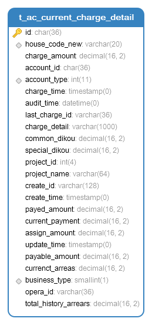
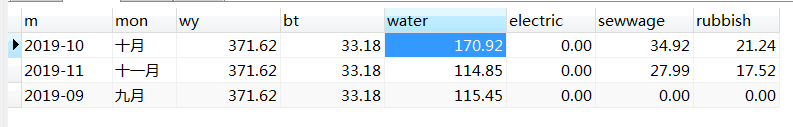

# MYSQL 分组函数的使用
生产中遇到一个需要按月分组统计的需求，纠结了一天，最后找了DBA帮忙解决了这个问题，其中就使用到了group by 这个分组函数

表结构如下：



需要得到的效果如下：



单表的sql操作，按道理应该是很简单的，花了一天的时间都没有想出来，还是sql能力薄弱哇；

dba给出的解决方案是：
```
SELECT m,
			 mon,
			 wy,
			 sum(bt) as bt,
			 sum(water) as water,
			 sum(electric) as electric,
			 sum(sewwage) as sewwage,
			 sum(rubbish)  as rubbish FROM(
			 SELECT
						x.m,
						x.mon,
						IF(ta.account_type = 1,IFNULL(ta.currenct_arreas,0),0) as wy,
						IF(ta.account_type = 2,IFNULL(ta.currenct_arreas,0),0) as bt,
						IF(ta.account_type = 3,IFNULL(ta.currenct_arreas,0),0) as water,
						IF(ta.account_type = 4,IFNULL(ta.currenct_arreas,0),0) as electric,
						IF(ta.account_type = 7,IFNULL(ta.currenct_arreas,0),0) as sewwage,
						IF(ta.account_type = 8,IFNULL(ta.currenct_arreas,0),0) as rubbish
						from (SELECT CONCAT(2019,'-01') m,'一月' mon
						UNION
						SELECT CONCAT(2019,'-02') m,'二月' mon
						UNION
						SELECT CONCAT(2019,'-03') m,'三月' mon
						UNION
						SELECT CONCAT(2019,'-04') m,'四月' mon
						UNION
						SELECT CONCAT(2019,'-05') m,'五月' mon
						UNION
						SELECT CONCAT(2019,'-06') m,'六月' mon
						UNION
						SELECT CONCAT(2019,'-07') m,'七月' mon
						UNION
						SELECT CONCAT(2019,'-08') m,'八月' mon
						UNION
						SELECT CONCAT(2019,'-09') m,'九月' mon
						UNION
						SELECT CONCAT(2019,'-10') m,'十月' mon
						UNION
						SELECT CONCAT(2019,'-11') m,'十一月' mon
						UNION
						SELECT CONCAT(2019,'-12') m,'十二月' mon)x
						LEFT JOIN t_ac_current_charge_detail ta
						on x.m = DATE_FORMAT(ta.charge_time,'%Y-%m')
						where 1 = 1
						AND house_code_new ='111111005011703' )t 
						group BY t.mon
```

思路就是 先汇总，再按照月份分组。