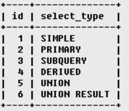

# Explain 关键字的使用

**场景**： 我们在mysql的使用过程中，经常需要知道每个sql执行的效率，分析一些SQL的性能，从能针对性的进行SQL优化。这个时候，EXPLAIN这个关键字就便可以派上用场了。

**作用**：模拟SQL执行器，分析每条SQL执行的效率。

## Explain相关的参数： ##

**id**  

查询序列号，表示查询子句顺序或者操作表的顺序。有三种情况：

	1、id值相同，执行顺序从上至下
	2、id值不同，值越大的优先执行
	3、id值有相同和不同的 --id 值相同时，可当做一组，从上至下执行；id值不同，值越大，优先执行
	

**select_type** 

分别用来表示查询的类型，主要是用于区别普通查询、联合查询、子查询等的复杂查询。

select_type 常见类型：

	
	SIMPLE 简单的select查询，查询中不包含子查询或者UNION	
	PRIMARY 查询中若包含任何复杂的子部分，最外层查询则被标记为PRIMARY	
	SUBQUERY 在SELECT或WHERE列表中包含了子查询
	DERIVED 在FROM列表中包含的子查询被标记为DERIVED（衍生），MySQL会递归执行这些子查询，把结果放在临时表中
	UNION 若第二个SELECT出现在UNION之后，则被标记为UNION：若UNION包含在FROM子句的子查询中，外层SELECT将被标记为：DERIVED
	UNION RESULT 从UNION表获取结果的SELECT

**table**

当前操作的表

**partitions**

代表给定表所使用的分区

**type**
访问类型

常用的类型有： ALL, index,  range, ref, eq_ref, const, system, NULL（从左到右，性能从差到好）
ALL：Full Table Scan， MySQL将遍历全表以找到匹配的行
	
	index: Full Index Scan，index与ALL区别为index类型只遍历索引树	

	range:只检索给定范围的行，使用一个索引来选择行	

	ref: 表示上述表的连接匹配条件，即哪些列或常量被用于查找索引列上的值	

	eq_ref: 类似ref，区别就在使用的索引是唯一索引，对于每个索引键值，表中只有一条记录匹配，简单来说，就是多表连接中使用primary key或者 unique key作为关联条件	

	const、system: 当MySQL对查询某部分进行优化，并转换为一个常量时，使用这些类型访问。如将主键置于where列表中，MySQL就能将该查询转换为一个常量,system是const类型的特例，当查询的表只有一行的情况下，使用system	

	NULL: MySQL在优化过程中分解语句，执行时甚至不用访问表或索引，例如从一个索引列里选取最小值可以通过单独索引查找完成。

 

**possible_keys**

显示可能应用在这张表中的索引，一个或多个。查询涉及到的字段上若存在索引，则该索引将被列出，但不一定被查询实际使用。

**key**

实际使用的索引，如果为NULL，则没有使用索引。（可能原因包括没有建立索引或索引失效）

**key_len**

表示索引中使用的字节数，可通过该列计算查询中使用的索引的长度，在不损失精确性的情况下，长度越短越好。key_len显示的值为索引字段的最大可能长度，并非实际使用长度，即key_len是根据表定义计算而得，不是通过表内检索出的。【查询精度越高、值越大】

**ref**

显示索引的那一列被使用了，如果可能的话，最好是一个常数。哪些列或常量被用于查找索引列上的值。

**rows**

根据表统计信息及索引选用情况，大致估算出找到所需的记录所需要读取的行数。【值越小越好】

**filtered**

返回结果的行占需要读到的行(rows列的值)的百分比

filtered 列给出了一个百分比的值，这个百分比值和rows 列的值相乘，可以估计出那些将要和QEP 中的前一个表进行连接的行的数目。前一个表就是指id 列的值比当前表的id 小的表。

**Extra**

包含不适合在其他列中显式但十分重要的额外信息