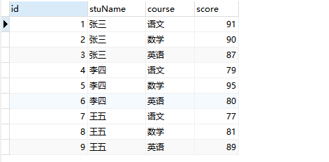
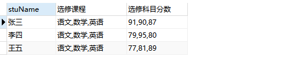

# Group_ooncat() 函数
场景：
 
 原始数据：
 
    
    
 将所有学生选择科目、分数合并为以学生为维度一行展示，最终达到的效果如下：
 
 
 
 解决方案：
 
 此时就该我们今天的主角儿登场了：
 
    SELECT stuName,
         GROUP_CONCAT(course) '选修课程',
         GROUP_CONCAT(score) '选修科目分数'
    from tb_grade
    GROUP BY stuName