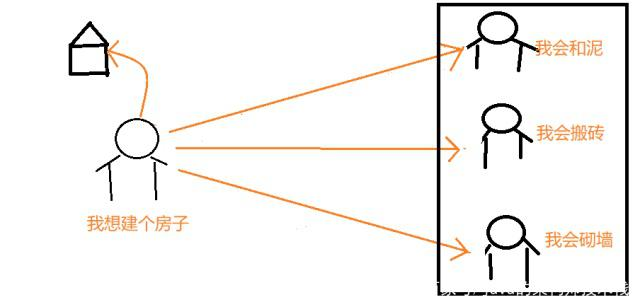

# 设计模式之门面模式

## FACADE【门面模式】
【定义】外部与系统内部的子系统通讯必须通过一个统一的门面对象进行。门面模式提供了一个高层次的接口，使得子系统更易于使用。

【生活示例】

有个深漂，叫墨言。在奋斗很多年年，终于存了点积蓄，想在老家修栋小洋楼。这时候怎么办呢？
当然他肯定不会是自己一个人盖房子，所以就想着找其他人。首先他需要找一个会砌墙的、会和泥的、会搬砖的等等。

后来墨言一想，这也太麻烦了。
我要自己找这些人，还要分别和这些人谈价格，还要给这些人之间调节好关系。要是有一个人给我处理这些事多好！
来有人给他推荐了包工头，自己什么都不需要处理，让包工头做这些就好了。张三很开心，立马找了包工头。

这里的包工头就是门面模式

【与代理模式的区别】
晃眼一看，怎么和dialing模式这么像呢，是的，他们既有共同之处，又有不同。

相同点：
他们都引入了中介，起到了代理的功能。

不同点：
①代理模式只代理一个类，而且代理类与原类实现相同的抽象。
②门面类就不一样了，他代理的是一系列类，与子系统可以有不同的抽象。

【开发示例】
我们在使用日志框架的时候，建议使用Self4j提供的门面接口，而不是直接使用Log4j,logback等日志工具类直接提供的API,
这样便于某一天，某个具体实现的日志工具有问题，能够很方便的切换为其它的日志工具。

【Java实现】

客户端：

    /**
     * @description: 墨言客户
     * @author: Tingyin.Xu
     * @email : sunshinexuty@163.com
     * @create: 2019-12-22 15:32
     **/
    public class MoYanClient {
        public void wantHouse() {
            ContractorCafade contractorCafade = new ContractorCafade();
            contractorCafade.can();
        }
    }
    
 
 门面类：
 
    /**
     * @description:包工头
     * @author: Tingyin.Xu
     * @email : sunshinexuty@163.com
     * @create: 2019-12-22 15:29
     **/
    public class ContractorCafade {
        public void can() {
            Mason mason = new Mason();
            Himma himma = new Himma();
            Bracklayer bracklayer = new Bracklayer();
            mason.can();
            himma.can();
            bracklayer.can();
        }
    
    }

子系统各个角色：

    /**
     * @描述 砌墙工人
     * @创建人 Tingyin.xu
     * @创建时间 2019/12/22 15:23
     */
    public class Bracklayer {
    
        public void can() {
            System.out.println("我会砌墙！");
        }
    }
    /**
     * @描述 和泥工人
     * @创建人 Tingyin.xu
     * @创建时间 2019/12/22 15:28
     */
    public class Himma {
        public void can() {
            System.out.println("我会和泥！");
        }
    }

    /**
     * @描述 搬砖工人
     * @创建人 Tingyin.xu
     * @创建时间 2019/12/22 15:28
     */
    public class Mason {
        public void can() {
            System.out.println("我会搬砖！");
        }
    }
