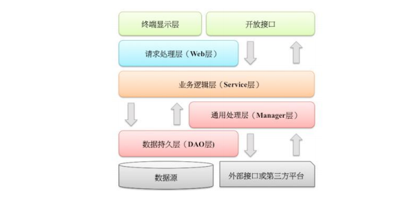

# java 开发规范【基于阿里巴巴Java开发规范】

## 一、编程规约
### 1.1.命名风格
1、代码中的命名均不能以下划线和美元符号开始，也不能以此结尾。

反例：-name/$name/name-/name$

2、代码中的命名严禁使用拼音和英文混合的方式，更不允许直接使用中文的方式。

3、类名使用UpperCamelCase风格，但下列情形除外：DO/PO/DTO/VO/BO等

4、方法名、参数名、变量名均使用lowerCamelCase风格

如：getHttpMessage()/inputName/userName

5、常量名统一使用大写字母，单词之间使用下划线连接，力求表达清楚含义，不要嫌名字长

如：CACHE_EXPIRED_TIME

6、抽象类命名使用 Abstract 或 Base 开头； 异常类命名使用 Exception 结尾； 测试类
命名以它要测试的类的名称开始，以 Test 结尾。

7、类型与中括号紧挨相连来表示数组。

8、POJO 类中布尔类型的变量，都不要加 is 前缀，否则部分框架解析会引起序列化错误。

9、包名统一使用小写，点分隔符之间有且仅有一个自然语言的英语单词。并且包名统一使用单数形式。如果类名有复数形式可以使用复数。

10、杜绝安全不规范的缩写，避免望文生义。不要长，将每个类名、属性、方法完整表达清楚。

11、接口中的方法和属性不要添加任何修饰符（public也不要加），并加上有效的javadoc 注释。

12、枚举类名建议带上Enum后缀，枚举成员名称需要全大写，单词间用下划线隔开。

13、各层命名规范：
    A)Service/DAO层

	 1）获取单个对象的方法用get作为前缀
	
	 2）获取多个对象的方法用list作为前缀，复数形式结尾如：listObjects。
	
	 3）获取统计值的方法用count()
	
	 4)插入方法使用save/insert 作为前缀
	
	 5）删除方法用remove/delete作为前缀
	
	 6）修改方法使用update作为前缀
	
	B)领域命名规范
	
	 1）数据对象：xxxDO,xxx表示数据表名
	
	 2）数据传输对象，xxxDTO，xxx为业务相关的名称
	
	 3）展示对象：xxxVO，xxx一般为网页名称
	
	 4）POJO为DO/DTO/BO/VO的统称，禁止使用xxxPOJO命名 

### 1.2.常量定义

1、不允许使用任何魔法值（未经预先定义的常量）直接在代码中使用

如：String key = "Id#taoabo"+tableId;

2、在使用long或者Long 类型时，数值后要使用大写L,不能使用小写，容易和数字1混淆

3、不要使用一个常量类维护所有常量， 要按常量功能进行归类，分开维护。

说明： 大而全的常量类， 杂乱无章， 使用查找功能才能定位到修改的常量，不利于理解和维护。

4、如果变量值仅在一个固定范围内变化用 enum 类型来定义。

说明： 如果存在名称之外的延伸属性应使用 enum 类型，下面正例中的数字就是延伸信息，表示一年中的
第几个季节。

正例：
```
     public enum SeasonEnum {
    	   SPRING(1), SUMMER(2), AUTUMN(3), WINTER(4);
    	    private int seq;
       SeasonEnum(int seq) {
    	   this.seq = seq;
    	}
    	public int getSeq() {
    	  return seq;
    	   }
    	}
```

### 1.3.代码格式
1、如果是大括号内为空，则简洁地写成{}即可，大括号中间无需换行和空格；如果是非
空代码块则：

	1） 左大括号前不换行。
	
	2） 左大括号后换行。
	
	3） 右大括号前换行。
	
	4） 右大括号后还有 else 等代码则不换行；表示终止的右大括号后必须换行。

2、左小括号和字符之间不出现空格；同样，右小括号和字符之间也不出现空格；而左
大括号前需要空格。

3、if/for/while/switch/do 等保留字与括号之间都必须加空格。

4、任何二目、 三目运算符的左右两边都需要加一个空格。

5、采用 4 个空格缩进，禁止使用 tab 字符。

```
正例： （涉及 1-5 点）
public static void main(String[] args) {
// 缩进 4 个空格
String say = "hello";
// 运算符的左右必须有一个空格
int flag = 0;
// 关键词 if 与括号之间必须有一个空格，括号内的 f 与左括号，0 与右括号不需要空格
if (flag == 0) {
System.out.println(say);
}
// 左大括号前加空格且不换行；左大括号后换行
if (flag == 1) {
System.out.println("world");
// 右大括号前换行，右大括号后有 else，不用换行
} else {
System.out.println("ok");
// 在右大括号后直接结束，则必须换行
}
}
```

6、注释的双斜线与注释内容之间有且仅有一个空格。

如：

// 这是示例注释，请注意在双斜线之后有一个空格

String param = new String();

7、方法参数在定义和传入时，多个参数逗号后边必须加空格。

8、IDE 的 text file encoding 设置为 UTF-8; IDE 中文件的换行符使用 Unix 格式，不
要使用 Windows 格式。
 
9、单个方法的总行数不超过 80 行。

10、不同逻辑、不同语义、不同业务的代码之间插入一个空行分隔开来以提升可读性。
 
### 1.4.OOP规范
1、避免通过一个类的对象引用访问此类的静态变量或静态方法，无谓增加编译器解析
成本，直接用类名来访问即可。

2、所有的覆写方法，必须加@Override 注解。

3、方法参数超过3个就封装为对象

4、不要使用过时的类和方法

5、外部正在调用或者二方库依赖的接口，不允许修改方法签名，避免对接口调用方产
生影响。接口过时必须加@Deprecated 注解，并清晰地说明采用的新接口或者新服务是什
么。

6、Object 的 equals 方法容易抛空指针异常，应使用常量或确定有值的对象来调用
equals。

如："test".equals(object); 而不是 object.equals("test");

7、所有整型包装类对象之间值的比较， 全部使用 equals 方法比较。

说明： 对于 Integer var = ? 在-128 至 127 范围内的赋值， Integer 对象是在 IntegerCache.cache 产
生，会复用已有对象，这个区间内的 Integer 值可以直接使用==进行判断，但是这个区间之外的所有数
据，都会在堆上产生，并不会复用已有对象，这是一个大坑，推荐使用 equals 方法进行判断。

8、浮点数之间的等值判断，基本数据类型不能用==来比较，包装数据类型统一改为BigDecimal 类型进行
equals 来判断。

9、定义数据对象 DO 类时，属性类型要与数据库字段类型相匹配。

如：数据库字段的 bigint 必须与类属性的 Long 类型相对应。如果 id 字段定义类型 bigint unsigned，实际类对象属性为 Integer，随着 id 越来越大，超过 Integer 的表示范围而溢出成为负数。

10、 为了防止精度损失， 禁止使用构造方法 BigDecimal(double)的方式把 double 值转
化为 BigDecimal 对象。

优先推荐：入参为 String 的构造方法，或使用 BigDecimal 的 valueOf 方法，此方法内部其实执行了
Double 的 toString，而 Double 的 toString 按 double 的实际能表达的精度对尾数进行了截断。

如： 

	BigDecimal recommend1 = new BigDecimal("0.1");
	BigDecimal recommend2 = BigDecimal.valueOf(0.1);

11、关于基本数据类型与包装数据类型的使用标准如下：

1） 【强制】所有的 POJO 类属性必须使用包装数据类型。

2） 【强制】RPC 方法的返回值和参数必须使用包装数据类型。

3） 【推荐】所有的局部变量使用基本数据类型

12、定义 DO/DTO/VO 等 POJO 类时，不要设定任何属性默认值。

13、序列化类新增属性时，请不要修改 serialVersionUID 字段，避免反序列失败；如果
完全不兼容升级，避免反序列化混乱，那么请修改 serialVersionUID 值。

14、构造方法里面禁止加入任何业务逻辑，如果有初始化逻辑，请放在 init 方法中。

15、POJO 类必须写 toString 方法。使用 IDE 中的工具：source> generate toString
时，如果继承了另一个 POJO 类，注意在前面加一下 super.toString。

16、禁止在 POJO 类中，同时存在对应属性 xxx 的 isXxx()和 getXxx()方法。
说明：框架在调用属性 xxx 的提取方法时，并不能确定哪个方法一定是被优先调用到。
故：在设计是否存在的字段是，不要在前面加is，数据库中设置为含有is,POJO中不含，利用mybatis 的ResultMap 进行关联。

17、使用索引访问用 String 的 split 方法得到的数组时，需做最后一个分隔符后有无内
容的检查，否则会有抛 IndexOutOfBoundsException 的风险。

### 1.5.集合处理规范
1、关于 hashCode 和 equals 的处理，遵循如下规则：

1） 只要覆写 equals，就必须覆写 hashCode。

2） 因为 Set 存储的是不重复的对象，依据 hashCode 和 equals 进行判断，所以 Set 存储的对象必须覆 写这两个方法。

3） 如果自定义对象作为 Map 的键，那么必须覆写 hashCode 和 equals。

2、ArrayList 的 subList 结果不可强转成 ArrayList，否则会抛出 ClassCastException 异 常，即 java.util.RandomAccessSubList cannot be cast to java.util.ArrayList。

说明：subList 返回的是 ArrayList 的内部类 SubList，并不是 ArrayList 而是 ArrayList 的一个视图，对
于 SubList 子列表的所有操作最终会反映到原列表上

3、使用 Map 的方法 keySet()/values()/entrySet()返回集合对象时，不可以对其进行添
加元素操作，否则会抛出 UnsupportedOperationException 异常。

4、Collections 类返回的对象，如：emptyList()/singletonList()等都是 immutable 
list，不可对其进行添加或者删除元素的操作。

5、在 subList 场景中，高度注意对原集合元素的增加或删除，均会导致子列表的遍
历、增加、删除产生 ConcurrentModificationException 异常。

6、使用集合转数组的方法，必须使用集合的 toArray(T[] array)，传入的是类型完全一
致、长度为 0 的空数组。

反例：直接使用 toArray 无参方法存在问题，此方法返回值只能是 Object[]类，若强转其它类型数组将出
现 ClassCastException 错误。

正例：

	List<String> list = new ArrayList<>(2);
	list.add("guan");
	list.add("bao");
	String[] array = list.toArray(new String[0]);

 说明：使用 toArray 带参方法，数组空间大小的 length： 
1） 等于 0，动态创建与 size 相同的数组，性能最好。

2） 大于 0 但小于 size，重新创建大小等于 size 的数组，增加 GC 负担。

3） 等于 size，在高并发情况下，数组创建完成之后，size 正在变大的情况下，负面影响与上相同。

4） 大于 size，空间浪费，且在 size 处插入 null 值，存在 NPE 隐患

7、在使用 Collection 接口任何实现类的 addAll()方法时，都要对输入的集合参数进行
NPE 判断。

说明：在 ArrayList#addAll 方法的第一行代码即 Object[] a = c.toArray(); 其中 c 为输入集合参数，如果
为 null，则直接抛出异常。

8、使用工具类 Arrays.asList()把数组转换成集合时，不能使用其修改集合相关的方
法，它的 add/remove/clear 方法会抛出 UnsupportedOperationException 异常。

9、泛型通配符<? extends T>来接收返回的数据，此写法的泛型集合不能使用 add 方 法，而<? super T>不能使用 get 方法，作为接口调用赋值时易出错。

10、在无泛型限制定义的集合赋值给泛型限制的集合时，在使用集合元素时，需要进行
instanceof 判断，避免抛出 ClassCastException 异常。

11、不要在 foreach 循环里进行元素的 remove/add 操作。remove 元素请使用
Iterator 方式，如果并发操作，需要对 Iterator 对象加锁。

12、集合初始化时，指定集合初始值大小。

说明：HashMap 使用 HashMap(int initialCapacity) 初始化。

正例：initialCapacity = (需要存储的元素个数 / 负载因子) + 1。注意负载因子（即 loader factor）默认
为 0.75，如果暂时无法确定初始值大小，请设置为 16（即默认值）。

反例：HashMap 需要放置 1024 个元素，由于没有设置容量初始大小，随着元素不断增加，容量 7 次被
迫扩大，resize 需要重建 hash 表，严重影响性能。

13、使用 entrySet 遍历 Map 类集合 KV，而不是 keySet 方式进行遍历。

说明：keySet 其实是遍历了 2 次，一次是转为 Iterator 对象，另一次是从 hashMap 中取出 key 所对应
的 value。而 entrySet 只是遍历了一次就把 key 和 value 都放到了 entry 中，效率更高。如果是 JDK8，
使用 Map.forEach 方法。

正例：values()返回的是 V 值集合，是一个 list 集合对象；keySet()返回的是 K 值集合，是一个 Set 集合
对象；entrySet()返回的是 K-V 值组合集合。	

### 1.6.并发处理
1、获取单例对象需要保证线程安全，其中的方法也要保证线程安全。
说明：资源驱动类、工具类、单例工厂类都需要注意。

2、创建线程或线程池时请指定有意义的线程名称，方便出错时回溯。

3、线程资源必须通过线程池提供，不允许在应用中自行显式创建线程。

说明：线程池的好处是减少在创建和销毁线程上所消耗的时间以及系统资源的开销，解决资源不足的问
题。如果不使用线程池，有可能造成系统创建大量同类线程而导致消耗完内存或者“过度切换”的问题。

4、线程池不允许使用 Executors 去创建，而是通过 ThreadPoolExecutor 的方式，这
样的处理方式让写的同学更加明确线程池的运行规则，规避资源耗尽的风险。

说明：Executors 返回的线程池对象的弊端如下：
1） FixedThreadPool 和 SingleThreadPool：
允许的请求队列长度为 Integer.MAX_VALUE，可能会堆积大量的请求，从而导致 OOM。 

2） CachedThreadPool：
允许的创建线程数量为 Integer.MAX_VALUE，可能会创建大量的线程，从而导致 OOM。

5、SimpleDateFormat 是线程不安全的类，一般不要定义为 static 变量，如果定义为
static，必须加锁，或者使用 DateUtils 工具类。
正例：注意线程安全，使用 DateUtils。亦推荐如下处理：

	private static final ThreadLocal<DateFormat> df = new ThreadLocal<DateFormat>() { 
	   @Override 
	   protected DateFormat initialValue() { 
	   return new SimpleDateFormat("yyyy-MM-dd"); 
	} 
	};
 
说明：如果是 JDK8 的应用，可以使用 Instant 代替 Date，LocalDateTime 代替 Calendar，
DateTimeFormatter 代替 SimpleDateFormat，官方给出的解释：simple beautiful strong immutable 
thread-safe。

### 1.7 控制语句
1、在一个 switch 块内，每个 case 要么通过 continue/break/return 等来终止，要么
注释说明程序将继续执行到哪一个 case 为止；在一个 switch 块内，都必须包含一个
default 语句并且放在最后，即使它什么代码也没有。

说明：注意 break 是退出 switch 语句块，而 return 是退出方法体。

2、当 switch 括号内的变量类型为 String 并且此变量为外部参数时，必须先进行 null
  判断。

3、在 if/else/for/while/do 语句中必须使用大括号。

  说明：即使只有一行代码，避免采用单行的编码方式：if (condition) statements;
  
4、在高并发场景中，避免使用”等于”判断作为中断或退出的条件。

  说明：如果并发控制没有处理好，容易产生等值判断被“击穿”的情况，使用大于或小于的区间判断条件
  来代替 。
5、表达异常的分支时，少用 if-else 方式，这种方式可以改写成：

      if (condition) { 
       ... 
       return obj; 
      } 
      // 接着写 else 的业务逻辑代码;
       
  说明：如果非使用 if()...else if()...else...方式表达逻辑，避免后续代码维护困难，【强制】请勿超过 3 层。
  
  正例：超过 3 层的 if-else 的逻辑判断代码可以使用卫语句、策略模式、状态模式等来实现，其中卫语句
  即代码逻辑先考虑失败、异常、中断、退出等直接返回的情况，以方法多个出口的方式，解决代码中判断
  分支嵌套的问题，这是逆向思维的体现。
  示例如下：
      
      public void findBoyfriend(Man man) {
       if (man.isUgly()) {
       System.out.println("本姑娘是外貌协会的资深会员");
       return;
       }
       if (man.isPoor()) {
       System.out.println("贫贱夫妻百事哀");
       return;
       }
       if (man.isBadTemper()) {
       System.out.println("银河有多远，你就给我滚多远");
       return;
       }
      System.out.println("可以先交往一段时间看看");
      } 
      
### 1.8.注释约束
1、类、类属性、类方法的注释必须使用 Javadoc 规范，使用/**内容*/格式，不得使用
  // xxx 方式。

2、所有的抽象方法（包括接口中的方法）必须要用 Javadoc 注释、除了返回值、参数、
  异常说明外，还必须指出该方法做什么事情，实现什么功能。
  
3、所有的类都必须添加创建者和创建日期。

4、方法内部单行注释，在被注释语句上方另起一行，使用//注释。方法内部多行注释
  使用/* */注释，注意与代码对齐。
  
  
5、所有的枚举类型字段必须要有注释，说明每个数据项的用途。

6、与其“半吊子” 英文来注释，不如用中文注释把问题说清楚。专有名词与关键字保
  持英文原文即可。
  
7、谨慎注释掉代码。 在上方详细说明，而不是简单地注释掉。 如果无用，则删除。
  说明：代码被注释掉有两种可能性：1）后续会恢复此段代码逻辑。 2）永久不用。前者如果没有备注信
  息，难以知晓注释动机。后者建议直接删掉（代码仓库已然保存了历史代码）。
  
### 1.9 其它
1、在使用正则表达式时，利用好其预编译功能，可以有效加快正则匹配速度。

2、注意 Math.random() 这个方法返回是 double 类型，注意取值的范围 0≤x<1（能够
  取到零值，注意除零异常），如果想获取整数类型的随机数，不要将 x 放大 10 的若干倍然后
  取整，直接使用 Random 对象的 nextInt 或者 nextLong 方法。
  
3、获取当前毫秒数 System.currentTimeMillis(); 而不是 new Date().getTime();  

4、日期格式化时，传入 pattern 中表示年份统一使用小写的 y。

  说明：日期格式化时，yyyy 表示当天所在的年，而大写的 YYYY 代表是 week in which year
  （JDK7 之后引入的概念），意思是当天所在的周属于的年份，一周从周日开始，周六结束，
  只要本周跨年，返回的 YYYY 就是下一年。
  
  另外需要注意：
  ⚫ 表示月份是大写的 M

  ⚫ 表示分钟则是小写的 m
  
  ⚫ 24 小时制的是大写的 H
  
  ⚫ 12 小时制的则是小写的 h
  
  正例：表示日期和时间的格式如下所示：
  
    new SimpleDateFormat("yyyy-MM-dd HH:mm:ss")

5、不要在视图模板中加入任何复杂的逻辑。

  说明：根据 MVC 理论，视图的职责是展示，不要抢模型和控制器的活。

6、任何数据结构的构造或初始化，都应指定大小，避免数据结构无限增长吃光内存。

7、及时清理不再使用的代码段或配置信息。
  说明：对于垃圾代码或过时配置，坚决清理干净，避免程序过度臃肿，代码冗余。
  
## 二、异常日志

### 2.1 异常处理
1、Java 类库中定义的可以通过预检查方式规避的 RuntimeException 异常不应该通
  过 catch 的方式来处理，比如：NullPointerException，IndexOutOfBoundsException 等
  等。
 
 注：无法通过预检查的异常除外，比如，在解析字符串形式的数字时，可能存在数字格式错误，不得不
     通过 catch NumberFormatException 来实现。
  
2、异常不要用来做流程控制，条件控制。

3、catch 时请分清稳定代码和非稳定代码，稳定代码指的是无论如何不会出错的代码。
  对于非稳定代码的 catch 尽可能进行区分异常类型，再做对应的异常处理。
  
  说明：对大段代码进行 try-catch，使程序无法根据不同的异常做出正确的应激反应，也不利于定位问
  题，这是一种不负责任的表现。

4、捕获异常是为了处理它，不要捕获了却什么都不处理而抛弃之，如果不想处理它，
  请将该异常抛给它的调用者。最外层的业务使用者，必须处理异常，将其转化为用户可以理
  解的内容。
 
5、有 try 块放到了事务代码中，catch 异常后，如果需要回滚事务，一定要注意手动回
  滚事务。
  
6、finally 块必须对资源对象、流对象进行关闭，有异常也要做 try-catch。
  说明：如果 JDK7 及以上，可以使用 try-with-resources 方式。
  
7、不要在 finally 块中使用 return。

  说明：try 块中的 return 语句执行成功后，并不马上返回，而是继续执行 finally 块中的语句，如果此处存
  在 return 语句，则在此直接返回，无情丢弃掉 try 块中的返回点。

8、捕获异常与抛异常，必须是完全匹配，或者捕获异常是抛异常的父类.

9、在调用 RPC、二方包、或动态生成类的相关方法时，捕捉异常必须使用 Throwable
  类来进行拦截。
  
10、防止 NPE，是程序员的基本修养。

11、定义时区分 unchecked / checked 异常，避免直接抛出 new RuntimeException()，
   更不允许抛出 Exception 或者 Throwable，应使用有业务含义的自定义异常。推荐业界已定
   义过的自定义异常，如：DAOException / ServiceException 等。

12、对于公司外的 http/api 开放接口必须使用“错误码” ；而应用内部推荐异常抛出；
   跨应用间 RPC 调用优先考虑使用 Result 方式，封装 isSuccess()方法、 “错误码” 、 “错误
   简短信息” 。
  
13、避免出现重复的代码（Don't Repeat Yourself），即 DRY 原则。
### 2.2 日志处理
1、应用中不可直接使用日志系统（Log4j、 Logback）中的 API，而应依赖使用日志框架
  SLF4J 中的 API，使用门面模式的日志框架，有利于维护和各个类的日志处理方式统一。
  
2、所有日志文件至少保存 15 天，因为有些异常具备以“周”为频次发生的特点。网络
  运行状态、安全相关信息、系统监测、管理后台操作、用户敏感操作需要留存相关的网络日
  志不少于 6 个月。
  
3、应用中的扩展日志（如打点、临时监控、访问日志等）命名方式：
  appName_logType_logName.log。logType:日志类型，如 stats/monitor/access 等；logName:日志
  描述。这种命名的好处：通过文件名就可知道日志文件属于什么应用，什么类型，什么目的，也有利于归
  类查找
  
4、在日志输出时，字符串变量之间的拼接使用占位符的方式。
  说明：因为 String 字符串的拼接会使用 StringBuilder 的 append()方式，有一定的性能损耗。使用占位符
  仅是替换动作，可以有效提升性能。
  
5、对于 trace/debug/info 级别的日志输出，必须进行日志级别的开关判断。
  说明：虽然在 debug(参数)的方法体内第一行代码 isDisabled(Level.DEBUG_INT)为真时（Slf4j 的常见实
  现 Log4j 和 Logback），就直接 return，但是参数可能会进行字符串拼接运算。此外，如果
  debug(getName())这种参数内有 getName()方法调用，无谓浪费方法调用的开销。

例如：

     // 如果判断为真，那么可以输出 trace 和 debug 级别的日志
     if (logger.isDebugEnabled()) {
     logger.debug("Current ID is: {} and name is: {}", id, getName());
     }

6、避免重复打印日志，浪费磁盘空间，务必在 log4j.xml 中设置 additivity=false。

  正例：
    
    <logger name="com.taobao.dubbo.config" additivity="false">

7、异常信息应该包括两类信息：案发现场信息和异常堆栈信息。如果不处理，那么通 过关键字 throws 往上抛出。

  正例：logger.error(各类参数或者对象 toString() + "_" + e.getMessage(), e);

## 三、单元测试
1、好的单元测试必须遵守 AIR 原则。

  说明：单元测试在线上运行时，感觉像空气（AIR）一样并不存在，但在测试质量的保障上，却是非常关
  键的。好的单元测试宏观上来说，具有自动化、独立性、可重复执行的特点。
  
  ⚫ A：Automatic（自动化）
  
  ⚫ I：Independent（独立性）
  
  ⚫ R：Repeatable（可重复） 
 
2、单元测试应该是全自动执行的，并且非交互式的。测试用例通常是被定期执行的，
   执行过程必须完全自动化才有意义。输出结果需要人工检查的测试不是一个好的单元测试。
   单元测试中不准使用 System.out 来进行人肉验证，必须使用 assert 来验证。
 
3、保持单元测试的独立性。为了保证单元测试稳定可靠且便于维护，单元测试用例之
   间决不能互相调用，也不能依赖执行的先后次序。
   
   反例：method2 需要依赖 method1 的执行，将执行结果作为 method2 的输入。  
   
4、单元测试是可以重复执行的，不能受到外界环境的影响。

5、对于单元测试，要保证测试粒度足够小，有助于精确定位问题。单测粒度至多是类
  级别，一般是方法级别。
  
6、核心业务、核心应用、核心模块的增量代码确保单元测试通过。

说明：新增代码及时补充单元测试，如果新增代码影响了原有单元测试，请及时修正。  
 
7、单元测试代码必须写在如下工程目录：src/test/java，不允许写在业务代码目录下。

  说明：源码编译时会跳过此目录，而单元测试框架默认是扫描此目录。

## 四、安全规约
1、隶属于用户个人的页面或者功能必须进行权限控制校验。

2、用户敏感数据禁止直接展示，必须对展示数据进行脱敏。

3、用户输入的 SQL 参数严格使用参数绑定或者 METADATA 字段值限定，防止 SQL 注
  入，禁止字符串拼接 SQL 访问数据库。
  
4、用户请求传入的任何参数必须做有效性验证。

5、忽略参数校验可能导致：

  ⚫ page size 过大导致内存溢出
  
  ⚫ 恶意 order by 导致数据库慢查询
  
  ⚫ 任意重定向
  
  ⚫ SQL 注入
  
  ⚫ 反序列化注入
  
  ⚫ 正则输入源串拒绝服务 ReDoS
  
  说明：Java 代码用正则来验证客户端的输入，有些正则写法验证普通用户输入没有问题，但是如果攻
  击人员使用的是特殊构造的字符串来验证，有可能导致死循环的结果。 
  
6、禁止向 HTML 页面输出未经安全过滤或未正确转义的用户数据。

7、表单、AJAX 提交必须执行 CSRF 安全验证。

CSRF(Cross-site request forgery)跨站请求伪造是一类常见编程漏洞。对于存在 CSRF 漏洞的应用
/网站，攻击者可以事先构造好 URL，只要受害者用户一访问，后台便在用户不知情的情况下对数据库中
用户参数进行相应修改。

8、在使用平台资源，譬如短信、邮件、电话、下单、支付，必须实现正确的防重放的 机制，如数量限制、疲劳度控制、验证码校验，避免被滥刷而导致资损。

  说明：如注册时发送验证码到手机，如果没有限制次数和频率，那么可以利用此功能骚扰到其它用户，并
  造成短信平台资源浪费。 
  
## 五、编程规约
### 5.1.建表约束
1、表达是否概念的字段，使用is_xxx的方式命名，数据类型使用unsigned tinyint(1为是，0为否)

2、表名、字段名使用小写字母或者数字，但是禁止使用数字开头，禁止两个下划线之间只出现数字

正例：user_name,level3_name

反例：UserName,level_3_name

3、表名不要使用复数

4、禁用mysql中的关键字(保留字)，如desc、asc、range、select、detete 等。

5、主键索引使用pk_字段名；唯一索引使用 uk_字段名；普通索引使用idx_字段名。

6、小数类型为 decimal，禁止使用 float 和 double。
说明： 在存储的时候， float 和 double 都存在精度损失的问题，很可能在比较值的时候，得到不正确的
结果。如果存储的数据范围超过 decimal 的范围，建议将数据拆成整数和小数并分开存储

7、如果存储的字符串长度几乎相等，使用 char 定长字符串类型。

8、varchar 是可变长字符串，不预先分配存储空间，长度不要超过 5000，如果存储长
度大于此值，定义字段类型为 text，独立出来一张表，用主键来对应，避免影响其它字段索
引效率。

9、表必备三字段： id, create_time, update_time。

说明：其中 id 必为主键，类型为 bigint unsigned、单表时自增、步长为 1。 create_time, update_time
的类型均为 datetime 类型。

10、库名与应用一致、表的命名最好是遵循“业务名称_表的作用” 。

### 5.2.索引约束
1、业务上具有唯一特性的字段，即使是多个字段的组合，也必须建成唯一索引。
说明：不要以为唯一索引影响了 insert 速度，这个速度损耗可以忽略，但提高查找速度是明显的；另外，
即使在应用层做了非常完善的校验控制，只要没有唯一索引，根据墨菲定律，必然有脏数据产生。

2、超过三个表禁止 join。需要 join 的字段，数据类型必须绝对一致；多表关联查询
时，保证被关联的字段需要有索引。
说明：即使双表 join 也要注意表索引、SQL 性能。

3、在 varchar 字段上建立索引时，必须指定索引长度，没必要对全字段建立索引，根据
实际文本区分度决定索引长度即可。

4、页面搜索严禁左模糊或者全模糊，如果需要请走搜索引擎来解决。
说明：索引文件具有 B-Tree 的最左前缀匹配特性，如果左边的值未确定，那么无法使用此索引。

5、建组合索引的时候，区分度最高的在最左边。

正例：如果 where a=? and b=? ，如果 a 列的几乎接近于唯一值，那么只需要单建 idx_a 索引即可。
说明：存在非等号和等号混合时，在建索引时，请把等号条件的列前置。如：where c>? and d=? 那么
即使 c 的区分度更高，也必须把 d 放在索引的最前列，即索引 idx_d_c。

### 5.3.语句约束
1、不要使用 count(列名)或 count(常量)来替代 count(*)，count(*)是 SQL92 定义的
标准统计行数的语法，跟数据库无关，跟 NULL 和非 NULL 无关。
说明：count(*)会统计值为 NULL 的行，而 count(列名)不会统计此列为 NULL 值的行。

2、count(distinct col) 计算该列除 NULL 之外的不重复行数，注意 count(distinct 
col1, col2) 如果其中一列全为 NULL，那么即使另一列有不同的值，也返回为 0。

3、当某一列的值全是 NULL 时，count(col)的返回结果为 0，但 sum(col)的返回结果
为 NULL，因此使用 sum()时需注意 NPE 问题。

4、使用 ISNULL()来判断是否为 NULL 值。
说明：NULL 与任何值的直接比较都为 NULL。 1） NULL<>NULL 的返回结果是 NULL，而不是 false。 2） NULL=NULL 的返回结果是 NULL，而不是 true。 3） NULL<>1 的返回结果是 NULL，而不是 true。

5、代码中写分页查询逻辑时，若 count 为 0 应直接返回，避免执行后面的分页语句。

6、不得使用外键与级联，一切外键概念必须在应用层解决。
	
说明：以学生和成绩的关系为例，学生表中的 student_id 是主键，那么成绩表中的 student_id 则为外
键。如果更新学生表中的 student_id，同时触发成绩表中的 student_id 更新，即为级联更新。外键与级
联更新适用于单机低并发，不适合分布式、高并发集群；级联更新是强阻塞，存在数据库更新风暴的风
险；外键影响数据库的插入速度。

7、禁止使用存储过程，存储过程难以调试和扩展，更没有移植性。

8、数据订正（特别是删除、修改记录操作）时，要先 select，避免出现误删除，确认无
误才能执行更新语句。

9、in 操作能避免则避免，若实在避免不了，需要仔细评估 in 后边的集合元素数量，控
制在 1000 个之内。

10、TRUNCATE TABLE 比 DELETE 速度快，且使用的系统和事务日志资源少，但
TRUNCATE 无事务且不触发 trigger，有可能造成事故，故不建议在开发代码中使用此语句。
说明：TRUNCATE TABLE 在功能上与不带 WHERE 子句的 DELETE 语句相同。

### 5.4.ORM约束
1、在表查询中，一律不要使用 * 作为查询的字段列表，需要哪些字段必须明确写明。

说明：

1）增加查询分析器解析成本。 

2）增减字段容易与 resultMap 配置不一致。

3）无用字段增加网络消耗，尤其是 text 类型的字段

2、POJO 类的布尔属性不能加 is，而数据库字段必须加 is_，要求在 resultMap 中进行
字段与属性之间的映射。

说明：参见定义 POJO 类以及数据库字段定义规定，在<resultMap>中增加映射，是必须的。 在
MyBatis Generator 生成的代码中，需要进行对应的修改。

3、不要用 resultClass 当返回参数，即使所有类属性名与数据库字段一一对应，也需要
定义；反过来，每一个表也必然有一个 POJO 类与之对应。

说明：配置映射关系，使字段与 DO 类解耦，方便维护。

4、sql.xml 配置参数使用：#{}，#param# 不要使用${} 此种方式容易出现 SQL 注入。

5、不允许直接拿 HashMap 与 Hashtable 作为查询结果集的输出。

6、 更新数据表记录时，必须同时更新记录对应的 gmt_modified 字段值为当前时间。

7、不要写一个大而全的数据更新接口。 传入为 POJO 类，不管是不是自己的目标更新
字段，都进行 update table set c1=value1,c2=value2,c3=value3; 这是不对的。执行 SQL
时，不要更新无改动的字段，一是易出错；二是效率低；三是增加 binlog 存储。

8、@Transactional 事务不要滥用。事务会影响数据库的 QPS，另外使用事务的地方
需要考虑各方面的回滚方案，包括缓存回滚、搜索引擎回滚、消息补偿、统计修正等。

#六、工程规约
###6.1应用分层
1、图中默认上层依赖于下层，箭头关系表示可直接依赖，如：开放接口层可以依赖于
  Web 层，也可以直接依赖于 Service 层，依此类推：
  
  
  • 开放接口层：可直接封装 Service 方法暴露成 RPC 接口；通过 Web 封装成 http 接口；进行网关安 全控制、流量控制等。 
  
  • 终端显示层：各个端的模板渲染并执行显示的层。当前主要是 velocity 渲染，JS 渲染，JSP 渲染，移动端展示等。 
  
  • Web 层：主要是对访问控制进行转发，各类基本参数校验，或者不复用的业务简单处理等。
   
  • Service 层：相对具体的业务逻辑服务层。 
  
  • Manager 层：通用业务处理层，它有如下特征：
  
  1） 对第三方平台封装的层，预处理返回结果及转化异常信息。 
  
  2） 对 Service 层通用能力的下沉，如缓存方案、中间件通用处理。
   
   3） 与 DAO 层交互，对多个 DAO 的组合复用。 
   
   • DAO 层：数据访问层，与底层 MySQL、Oracle、Hbase 等进行数据交互。 
   
   • 外部接口或第三方平台：包括其它部门 RPC 开放接口，基础平台，其它公司的 HTTP 接口。
   
2、（分层异常处理规约）在 DAO 层，产生的异常类型有很多，无法用细粒度的异常进
  行 catch，使用 catch(Exception e)方式，并 throw new DAOException(e)，不需要打印日志。
  
  因为日志在 Manager/Service 层一定需要捕获并打印到日志文件中去，如果同台服务器再打日志，浪费性能和存储。在 Service 层出现异常时，必须记录出错日志到磁盘，尽可能带上参数
  信息，相当于保护案发现场。如果 Manager 层与 Service 同机部署，日志方式与 DAO 层处理一致，如果是单独部署，则采用与 Service 一致的处理方式。
  
  Web 层绝不应该继续往上抛异常，因为已经处于顶层，如果意识到这个异常将导致页面无法正常渲染，那么就应该直接跳转到友好错误页面，加上用户容易理解的错误提示信息。开放接口层要将异常处理成错误码
和错误信息方式返回。

3、分层领域模型规约：

  • DO（Data Object）：此对象与数据库表结构一一对应，通过 DAO 层向上传输数据源对象。 
  
  • DTO（Data Transfer Object）：数据传输对象，Service 或 Manager 向外传输的对象。 
  
  • BO（Business Object）：业务对象，由 Service 层输出的封装业务逻辑的对象。 
  
  • AO（Application Object）：应用对象，在 Web 层与 Service 层之间抽象的复用对象模型，极为贴
  近展示层，复用度不高。 
  
  • VO（View Object）：显示层对象，通常是 Web 向模板渲染引擎层传输的对象。
  
  • Query：数据查询对象，各层接收上层的查询请求。注意超过2个参数的查询封装，禁止使用 Map 类来传输。

###6.2 服务器规范
1、高并发服务器建议调小 TCP 协议的 time_wait 超时时间。

  说明：操作系统默认 240 秒后，才会关闭处于 time_wait 状态的连接，在高并发访问下，服务器端会因为处于 time_wait 的连接数太多，可能无法建立新的连接，所以需要在服务器上调小此等待值。
  
2、调大服务器所支持的最大文件句柄数（File Descriptor，简写为 fd）。
  
  说明：主流操作系统的设计是将 TCP/UDP 连接采用与文件一样的方式去管理，即一个连接对应于一个fd。主流的 linux 服务器默认所支持最大 fd 数量为 1024，当并发连接数很大时很容易因为 fd 不足而出现
  “open too many files”错误，导致新的连接无法建立。建议将 linux 服务器所支持的最大句柄数调高数倍（与服务器的内存数量相关）。
  
3、给 JVM 环境参数设置-XX:+HeapDumpOnOutOfMemoryError 参数，让 JVM 碰到OOM 场景时输出 dump 信息。
  
  说明：OOM 的发生是有概率的，甚至相隔数月才出现一例，出错时的堆内信息对解决问题非常有帮助。
  
4、在线上生产环境，JVM 的 Xms 和 Xmx 设置一样大小的内存容量，避免在 GC 后调整
  堆大小带来的压力。
  
5、服务器内部重定向使用 forward；外部重定向地址使用 URL 拼装工具类来生成，否则会带来 URL 维护不一致的问题和潜在的安全风险。  