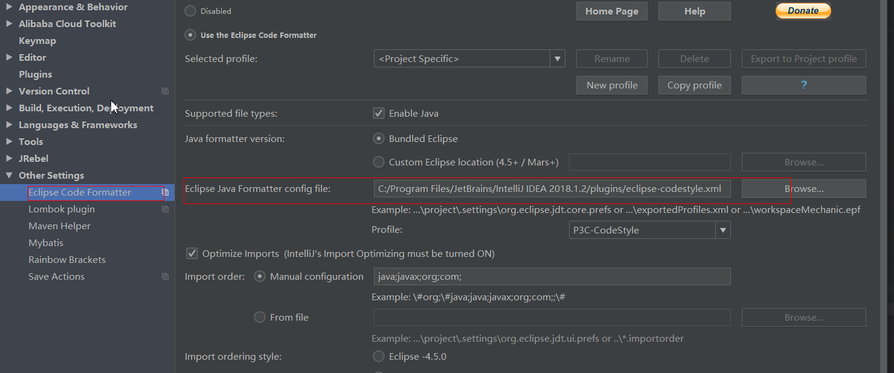
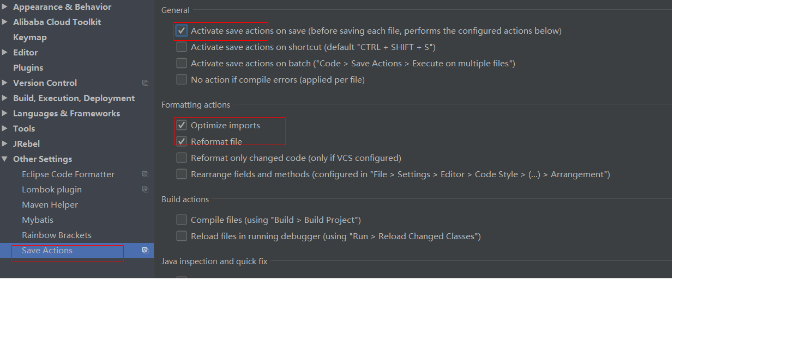

# IntelliJ IDEA 代码自动格式化

注：安装此自动格式化代码插件的目的是：

1、统一代码规范

2、自动保存，帮我们去除没有被引用 import 包 等

安装步骤：

1、IDEA plugins 搜索 Save Actions 插件安装

2、使用阿里代码格式化模板

①IDEA plugins 搜索 Eclipse Code Formatter插件 安装

② https://github.com/alibaba/p3c/tree/master/p3c-formatter 下载 eclipse-codestyle.xml 

③ 重启IDEA ，在 settings --> other settings --> Eclipse code Formatter 中 Eclipse Java Formatter config file  配置项 选择刚才下载的模板文件

④ 在settings --> other settings --> Save  Actions 
