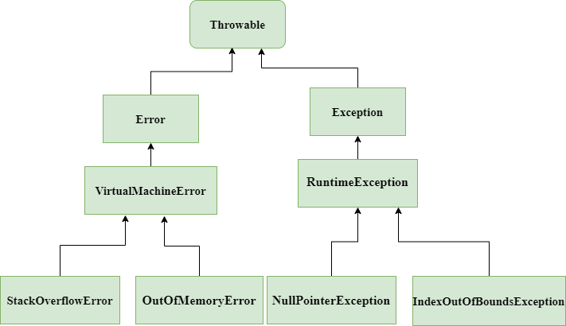

#Java 异常

Throwable 分为 Error 和Exception：

Error:程序员无法避免，由系统层面抛出的错误，JVM都处理不了，如
OutOfMemoryError、StackOverflowError

Exception:通过一些方式，可以避免的。例如
NullPointerException、ArrayIndexOutOfBoundsExceptiond etc.

关于Java异常处理的一些建议：
#### 1、永远不要catch中吞掉异常，否则在系统发生错误时，你永远不知道到底发生了什么。
   
    catch (SomeException e) {
      return  null;
    }

#### 2、尽量使用特定的异常而不是一律使用Exception这样太泛泛的异常

    public void foo() throws Exception { //错误的做法}
    public void foo() throws MyBusinessException1, MyBusinessException2 { //正确的做法}

#### 3、Never catch Throwable class
永远不要捕获Throwable,因为Error也是继承自它，Error是Jvm都处理不了的错误，你能处理？所以基于有些Jvm在Error时就不会让你catch住。

#### 4、正确的封装和传递异常
不要丢失异常栈，因为异常栈对于定位原始错误很关键
    
    catch (SomeException e) {
    throw  new MyServiceException("Some information: " + e.getMessage()); 
     //错误的做法
    }

一定要保留原始的异常：
    
    catch (SomeException e) {
       throw new MyServiceException("Some information: " , e);  
       //正确的打开方式
    }

#### 5、要打印异常，就不要抛出，不要两者都做
  
    catch (SomeException e) {
       LOGGER.error("Some information", e);
       //throw e;  这里就不要再抛出了
    }

这样的log没有任何意义，只会打印出一连串的error log，对于定位问题无济于事。

#### 6、不要在finally块中抛出异常
如果在finally中抛出异常，将会覆盖原始的异常,如果finally中真的可能会发生异常，那一定要处理并记录它，不要向上抛。

#### 7、不要使用printStackTrace
要给异常添加上有用的上下文信息，单纯的异常栈，没有太大意义。

#### 8、Throw early catch late
异常界著名的原则，错误发生时及早抛出，然后在获得所以全部信息时再捕获处理.也可以理解为在低层次抛出的异常，在足够高的抽象层面才能更好的理解异常，然后捕获处理。

#### 9、对于使用一些重量级资源的操作，发生异常时，一定记得清理
如网络连接，数据库操作等，可以用try finally来做clean up的工作。java7以上可以使用 try-with-resources

#### 10、不要使用异常来控制程序逻辑流程
我们总是不经意间这么做了，这样使得代码变更丑陋，使得正常业务逻辑和错误处理混淆不清；而且也可能会带来性能问题，因为异常是个比较重的操作。

#### 11、及早校验用户的输入
在最边缘的入口校验用户的输入，这样使得我们不用再更底层逻辑中处处校验参数的合法性，能大大简化业务逻辑中不必要的异常处理逻辑；相反，在业务中不如果担心参数的合法性，则应该使用卫语句抛出运行时异常，一步步把对参数错误的处理推到系统的边缘，保持系统内部的清洁。

#### 12、在打印错误的log中尽量在一行中包含尽可能多的上下文
    LOGGER.debug("enter A");
    LOGGER.debug("enter B"); //错误的方式     
    LOGGER.debug("enter A, enter B");//正确的方式

 
 

