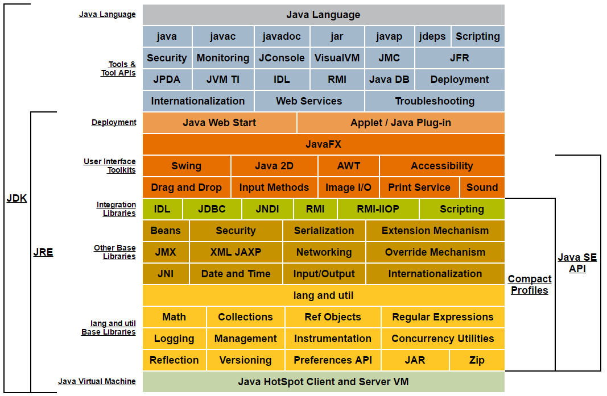
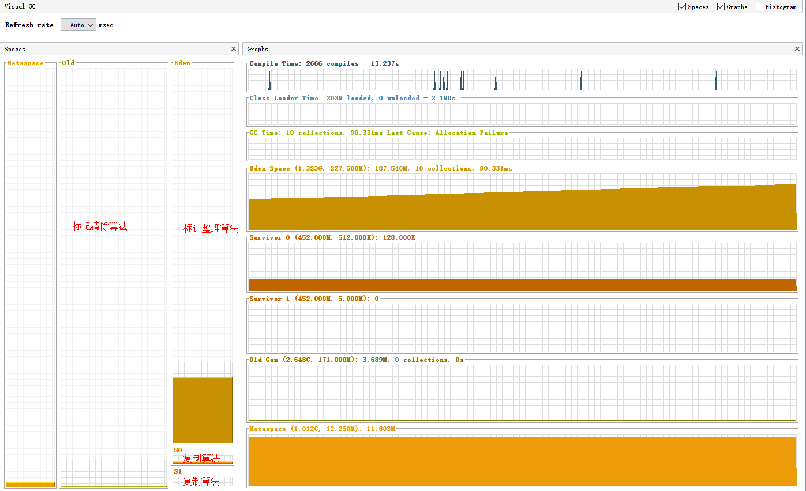

# 深入理解Java虚拟机笔记
## 第一部分 走近Java
### 第1章 走近Java
#### 1.1 概述
        
>世界上并没有完美的程序，但是我们并不因此而沮丧。因为写程序本身就是一个不断追求完美的过程。

####Java 技术体系

                  
## 第二部分 自动内存管理机制
>Java和C++之间有一堵由内存动态分配和垃圾收集技术围城的"高墙"，墙里的人想出来，墙外的人想进去。

## 第三部分 虚拟机执行子系统

## 第四部分 程序编译和代码优化

## 第五部分 高效并发

## 附录