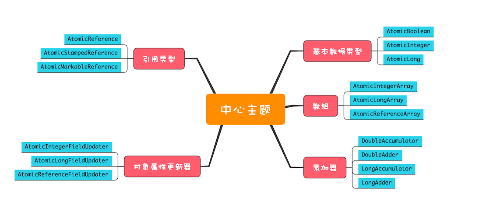

#Java并发实战
## 一、并发理论基础
### 1.1 并发编程出现BUG 的源头
    缓存导致的【可见性】问题         -->volatile
    线程切换带来的【原子性】问题     -->加锁
    编译器优化带来的【有序性】问题
     
### 1.2 Java内存模型：看Java如何解决可见性和有序性问题
    Happers-Before 六项原则：
    1、程序的顺序性原则
    2、volatile 变量规则
    3、传递性
    4、管程中锁的原则
    5、线程start()原则
    6、线程join()原则
    
    java 内存模型总结：
   
    1. 为什么定义Java内存模型？现代计算机体系大部是采用的对称多处理器的体系架构。
    每个处理器均有独立的寄存器组和缓存，多个处理器可同时执行同一进程中的不同线程，这里称为处理器的乱序执行。
    在Java中，不同的线程可能访问同一个共享或共享变量。
    如果任由编译器或处理器对这些访问进行优化的话，很有可能出现无法想象的问题，这里称为编译器的重排序。
    除了处理器的乱序执行、编译器的重排序，还有内存系统的重排序。
    因此Java语言规范引入了Java内存模型，通过定义多项规则对编译器和处理器进行限制，主要是针对可见性和有序性。
    
    2. 三个基本原则：原子性、可见性、有序性。
   
    3. Java内存模型涉及的几个关键词：锁、volatile字段、final修饰符与对象的安全发布。其中：第一是锁，锁操作是具备happens-before关系的，解锁操作happens-before之后对同一把锁的加锁操作。实际上，在解锁的时候，JVM需要强制刷新缓存，使得当前线程所修改的内存对其他线程可见。第二是volatile字段，volatile字段可以看成是一种不保证原子性的同步但保证可见性的特性，其性能往往是优于锁操作的。但是，频繁地访问 volatile字段也会出现因为不断地强制刷新缓存而影响程序的性能的问题。第三是final修饰符，final修饰的实例字段则是涉及到新建对象的发布问题。当一个对象包含final修饰的实例字段时，其他线程能够看到已经初始化的final实例字段，这是安全的。
   
    4. Happens-Before的7个规则：
    (1).程序次序规则：在一个线程内，按照程序代码顺序，书写在前面的操作先行发生于书写在后面的操作。准确地说，应该是控制流顺序而不是程序代码顺序，因为要考虑分支、循环等结构。
    (2).管程锁定规则：一个unlock操作先行发生于后面对同一个锁的lock操作。这里必须强调的是同一个锁，而"后面"是指时间上的先后顺序。
    (3).volatile变量规则：对一个volatile变量的写操作先行发生于后面对这个变量的读操作，这里的"后面"同样是指时间上的先后顺序。
    (4).线程启动规则：Thread对象的start()方法先行发生于此线程的每一个动作。
    (5).线程终止规则：线程中的所有操作都先行发生于对此线程的终止检测，我们可以通过Thread.join（）方法结束、Thread.isAlive（）的返回值等手段检测到线程已经终止执行。
    (6).线程中断规则：对线程interrupt()方法的调用先行发生于被中断线程的代码检测到中断事件的发生，可以通过Thread.interrupted()方法检测到是否有中断发生。
    (7).对象终结规则：一个对象的初始化完成(构造函数执行结束)先行发生于它的finalize()方法的开始。
   
    5. Happens-Before的1个特性：传递性。
   
    6. Java内存模型底层怎么实现的？主要是通过内存屏障(memory barrier)禁止重排序的，即时编译器根据具体的底层体系架构，将这些内存屏障替换成具体的 CPU 指令。
    对于编译器而言，内存屏障将限制它所能做的重排序优化。而对于处理器而言，内存屏障将会导致缓存的刷新操作。比如，对于volatile，编译器将在volatile字段的读写操作前后各插入一些内存屏障。

### 1.3 互斥锁（上）：解决原子性问题
    互斥保证同一时刻只有一个线程在执行
    
    实现互斥的方式：
    1、synchronized
    synchronized作用范围可以是类，静态方法、非静态方法、代码块
    
    ***:当修饰静态方法的时候，锁定的是当前类的 Class 对象，当修饰非静态方法的时候，锁定的是当前实例对象 this。
    
### 1.4 互斥锁（下）：如何用一把锁保护多个资源？
     1、当多个资源之间没有任何关系时--为每个资源都加上一把锁即可
     2、多个资源之间存在关系，例如银行转账业务。选择一个粒度更大的锁，这个锁应该能够覆盖所有相关的资源。
     
     PS： 根据资源的关系，确定锁的粒度大小，到底对什么资源进行加锁
     
     可变对象不能作为锁
### 1.5 一不小心就死锁了，怎么办？
     出现死锁的条件：只有当同事满足如下四个条件时，才能出现死锁：
     1、互斥，共享资源X和Y只能被一个线程占用。
     2、占有且等待，线程T1在已经获取了共享资源X，在等待获取共享资源Y的时候，不释放共享资源X。
     3、不可抢占，其它线程不能抢占线程T1占有的资源。
     4、循环等待，线程T1等待线程T2释放共享资源，线程T2等待线程T1释放共享资源，便是循环等待。
     
     
     如何解决死锁：
     破坏上述条件中的2、3、4其中一个即可。但要根据实际操作成本，选择合适的方案。 
     
### 1.6 用“等待-通知”机制优化循环等待
    在java 使用使用 synchronized 可以实现互斥锁，使用wait(),notify()、notifyall()可以很好的实现“等待-通知”机制。
    
    notify   -- 通知正在等待的任何一个线程
    notifyall-- 通知所有正在等待的线程
    
    课后练习：wait 和sleep 都能让当前线程挂起一段时间，那么二者的区别在于？
    答：
    1：wait释放资源，sleep不释放资源
    2：wait需要被唤醒，sleep不需要
    3：wait需要获取到监视器，否则抛异常，sleep不需要
    4：wait是object顶级父类的方法，sleep则是Thread的方法   
### 1.7 安全性、活跃性以及性能问题
    并发程序的设计微观上涉及到原子性问题、可见性问题和有序性问题，宏观则表现为安全性、活跃性以及性能问题。
    
    性能问题涉及的因素主要有：
    
        吞吐量：指的是单位时间内能处理的请求数量。吞吐量越高，说明性能越好。
        
        延迟：指的是从发出请求到收到响应的时间。延迟越小，说明性能越好。
        
        并发量：指的是能同时处理的请求数量，一般来说随着并发量的增加、延迟也会增加。
        
        所以延迟这个指标，一般都会是基于并发量来说的。例如并发量是 1000 的时候，延迟是 50 毫秒。
    
### 1.8 管程：并发编程的万能钥匙
      管程：指的是管理共享变量以及对共享变量的操作过程，让他们支持并发。翻译为 Java 领域的语言，就是管理类的成员变量和成员方法，让这个类是线程安全的。
      
      并发中两大核心问题：
      互斥:即同一时刻只允许一个线程访问共享资源 
     
      同步:线程之间如何通信、协作
      
      java5 之前，synchronized 是管程的具体实现，JVM 会 自动对使用synchronized关键字修饰的代码进行加锁解锁操作。
      java5 之后，增加了JUC 相关的并发操作类，需要开发人员手动进行加解锁操作
      
 ### 1.9  Java线程（上）：Java线程的生命周期
    操作系统层面线程的生命周期:
    初始状态、可运行状态、运行状态、休眠状态、终止状态
    
    Java 中线程的生命周期：
    NEW(初始状态)：
    RUNANABLE(可运行状态)
    BLOCKED(阻塞状态)
    WAITING(无限等待状态)
    TIME_WAITING(有限等待状态)
    TERMINATED(终止状态)
    
    
 ### 1.10 Java线程（中）：创建多少线程才是合适的？
    1、为什么要使用多线程？
    目的：提升性能
    ①评价性能的重要指标：
    a、吞吐量 ：单位时间内能够处理的请求数量；吞吐量越大，说明程序处理请求的数量越多，吞吐量越好。
    b、延时   ：发起请求到收到响应这个过程消耗的时间，时间越小，延时越短，说明性能也越好。
    
    最终的目的就是 降低延时、提高吞吐量。
    
    2、多线程的应用场景
    需要进行性能提高的场景下
    
    3、创建多少个线程合适？
    ①CPU密集型：对于 CPU 密集型的计算场景，理论上“线程的数量 =CPU 核数”就是最合适的。
    不过在工程上，线程的数量一般会设置为“CPU 核数 +1”，这样的话，当线程因为偶尔的内存页失效或其他原因导致阻塞时，
    这个额外的线程可以顶上，从而保证 CPU 的利用率。
    
    ②I/O密集型：最佳线程数 = CPU 核数 * [ 1 +（I/O 耗时 / CPU 耗时）]
    
    创建线程的多少，本质就是要将硬件的性能发挥到极致。
    
### 1.11 Java线程（下）：为什么局部变量是线程安全的？
    局部变量存放在调用的方法栈里
    
    每个线程都有自己独立的调用栈 ---> 局部变量就不会存在共享的问题，故也不会存在并发问题，因此，局部变量是线程安全的。
    
### 1.12 如何用面向对象思想写好并发程序？
    
#### 封装共享变量
    
    封装：将属性和实现细节封装到对象内部，外界对象只能通过目标对象提供的公共方法间接的访问内部属性。
    
    因此我们就可以将共享变量作为对象属性封装在对象内部，对所有公共方法制定并发访问策略。
    
    对于不会发生改变的共享变量，建议使用final进行修饰。
    
#### 识别共享变量间的约束条件
     共享变量之间的约束条件，反映在代码里，基本上都会有 if 语句;因此、有if的地方，就要注意是否会存在竞态条件
     
#### 制定并发访问策略
     1、避免共享：利用线程本地存储以及为每个任务分配独立的线程
     2、不变模式
     3、管程和其他同步工具：JUC 中的并发包工具
     
### 1.13 基础小结
    1、没有通吃的技术和方案，因为每种技术和方案都是优缺点和适用场景的。
    2、每个方法都是线程安全的，但组合起来不一定就是线程安全的。存在if的地方，就得考虑一下是否存在竞态条件
    3、方法调用是先计算参数
    
## 二、并发工具类
### 2.1 Lock和Condition（上）：隐藏在并发包中的管程
    为什么java 层面有了synchronized 关键字作为线程互斥的解决方案；Java SDK  中还增加了 Lock 这个接口用于实现互斥？
    
    Happens-Before 规则：
    顺序性规则
    volatile 变量规则
    传递性规则
    
    可重入锁：Reentranlock,可以重复获取同一把锁。
    
    永远只在更新对象的成员变量时加锁
    永远只在访问可变的成员变量时加锁
    永远不在调用其他对象的方法时加锁

    并发问题，本来就难以诊断，所以你一定要让你的代码尽量安全，尽量简单，哪怕有一点可能会出问题，都要努力避免。
    
    墨菲定律：凡是可能出错的事有很大几率会出错。

   
### 2.2 Lock和Condition（下）：Dubbo如何用管程实现异步转同步？
    同步VS异步：
    通俗的讲调用方是否需要等待结果，如果需要等待结果，就是同步；如果不需要等待结果，就是异步。
    
    Java 中默认情况下都是同步代码，如果需要实现异步，如何处理：
    1、调用方创建一个子线程，在子线程中执行方法调用，这种调用我们称为异步调用；
    2、方法实现的时候，创建一个新的线程执行主要逻辑，主线程直接 return，这种方法我们一般称为异步方法。
    
    Dubbo 为一个异步的RPC框架，内部做了异步转同步的操作。
    
### 2.3 Semaphore：如何快速实现一个限流器？    
    Semaphore 实现限流器：核心就是使用acquire() 和 release()
    
### 2.4 ReadWriteLock：如何快速实现一个完备的缓存？
    已经有了管程和信号量两个同步原语在Java中实现，为什么Java SDK 中如此多的并发工具类呢？
    原因就是：分场景优化性能，提升易用性。
    第一种场景：读多写少--缓存(常用的基础数据)
    
    Java SDK 中对应的实现为ReentrantReadWriteLock，读写锁都遵守的原则：
    1、允许多个线程同时读共享变量
    2、只允许一个线程写共享变量
    3、如果一个写线程正在执行写操作，此时禁止读线程读共享变量。
    
    
    ReentrantReadWriteLock 支持锁的降级，不支持锁的升级
    
### 2.5  StampedLock：有没有比读写锁更快的锁？
    StampedLock 支持 写锁、悲观读锁和乐观读
    使用StampedLock 需要注意以下几点：
    1、StampedLock 不支持重入
    2、StampedLock 的悲观读锁、写锁都不支持条件变量
    3、如果线程阻塞在 StampedLock 的 readLock() 或者 writeLock() 上时，此时调用该阻塞线程的 interrupt() 方法，会导致 CPU 飙升。
    
    
### 2-6 CountDownLatch和CyclicBarrier：如何让多线程步调一致？    
    CountDownLatch 实现线程等待--主要用于一个线程等待多个线程的场景
    CyclicBarrier 实现线程同步--主要是一组线程之间的相互等待
    
### 2-7 并发容器：都有哪些“坑”需要我们填？
    java中的容器有：Map、Set、List、Queue,对应的并发容器：
 
    
    非线程安全的容器如何转变为线程安全的容器:
    List list = Collections.synchronizedList(new ArrayList());
    Set set = Collections.synchronizedSet(new HashSet());
    Map map = Collections. synchronizedMap(new HashMap());
    
    并发容器避坑：
    1、用迭代器遍历容器
        List list = Collections.synchronizedList(new ArrayList());
        synchronized (list) { //这里很容易被忽略
          Iterator i = list.iterator(); 
          while (i.hasNext())
            foo(i.next());
        }    
### 2-8 原子类：无锁工具类的典范
    并发包中的原子类

    
    实际案例中，如果是解决单个共享变量的原子性问题时，我们使用JUC提供的原子类；
    如果是需要解决多个共享变量的原子性问题，应考虑使用互斥锁方案。
    
### 2-9 Executor与线程池：如何创建正确的线程池？
    
    线程池是一种生产者-消费者模式
    java 中的线程池工具类：ThreadPoolExecutor：
    
    ThreadPoolExecutor( int corePoolSize, 
                        int maximumPoolSize, 
                        long keepAliveTime, 
                        TimeUnit unit, 
                        BlockingQueue workQueue, 
                        ThreadFactory threadFactory, 
                        RejectedExecutionHandler handler)   
                        
    corePoolSize：表示线程池保有的最小线程数。有些项目很闲，但是也不能把人都撤了，至少要留 corePoolSize 个人坚守阵地。
    maximumPoolSize：表示线程池创建的最大线程数。当项目很忙时，就需要加人，但是也不能无限制地加，最多就加到 maximumPoolSize 个人。当项目闲下来时，就要撤人了，最多能撤到 corePoolSize 个人。
    keepAliveTime & unit：上面提到项目根据忙闲来增减人员，那在编程世界里，如何定义忙和闲呢？很简单，一个线程如果在一段时间内，都没有执行任务，说明很闲，keepAliveTime 和 unit 就是用来定义这个“一段时间”的参数。也就是说，如果一个线程空闲了keepAliveTime & unit这么久，而且线程池的线程数大于 corePoolSize ，那么这个空闲的线程就要被回收了。                    
    workQueue：工作队列。
    threadFactory：自定义如何创建线程，例如你可以给线程指定一个有意义的名字。
    handler：通过这个参数你可以自定义任务的拒绝策略。如果线程池中所有的线程都在忙碌，并且工作队列也满了（前提是工作队列是有界队列），那么此时提交任务，线程池就会拒绝接收。
    至于拒绝的策略，你可以通过 handler 这个参数来指定。ThreadPoolExecutor 已经提供了以下 4 种策略：
    
    CallerRunsPolicy：提交任务的线程自己去执行该任务。
    AbortPolicy：默认的拒绝策略，会 throws RejectedExecutionException。
    DiscardPolicy：直接丢弃任务，没有任何异常抛出。
    DiscardOldestPolicy：丢弃最老的任务，其实就是把最早进入工作队列的任务丢弃，然后把新任务加入到工作队列。
    
    
    在实际项目中，我们往往需要自定义线程池中线程的名称，便于出现问题时，更加快速的定位到具体线程，那么如何自定义线程名称呢，如下：
    
    首先自定义一个线程名称工厂：
    
     public class NamedThreadFactory implements ThreadFactory {
         private static final AtomicInteger POOL_NUMBER = new AtomicInteger(1);
         private final ThreadGroup group;
         private final AtomicInteger threadNumber = new AtomicInteger(1);
         private final String namePrefix;
     
         // 自定义线程命名规则
         public NamedThreadFactory(String name) {
     
             SecurityManager s = System.getSecurityManager();
             group = (s != null) ? s.getThreadGroup() : Thread.currentThread().getThreadGroup();
             if (null == name || name.isEmpty()) {
                 name = "pool";
             }
     
             namePrefix = name + "-" + POOL_NUMBER.getAndIncrement() + "-thread-";
         }
     
         // 实现 newThread 方法
         public Thread newThread(Runnable r) {
             Thread t = new Thread(group, r, namePrefix + threadNumber.getAndIncrement(), 0);
             if (t.isDaemon())
                 t.setDaemon(false);
             if (t.getPriority() != Thread.NORM_PRIORITY)
                 t.setPriority(Thread.NORM_PRIORITY);
             return t;
         }
     }
     
     在使用的时候，自定义名称：
     ThreadPoolExecutor executorOne = new ThreadPoolExecutor(5, 5, 1, TimeUnit.MINUTES, new LinkedBlockingQueue<>(), new NamedThreadFactory("测试1"));
     ThreadPoolExecutor executorTwo = new ThreadPoolExecutor(5, 5, 1, TimeUnit.MINUTES, new LinkedBlockingQueue<>(), new NamedThreadFactory("测试2"));

### 2-10 Future：如何用多线程实现最优的“烧水泡茶”程序？
       利用 Future可以获取异步任务执行的结果
       创建线程池的方式：
       1、Executors 工具类静态方法创建--优点：简单、快速；缺点：存在OOM的风险
       2、手动创建：new ThreadPoolExecutor(...)--优点：不存在OOM的隐患，缺点：参数过多，需要根据实际情况设置参数
       
### 2-11 CompletableFuture：异步编程没那么难
        为了提升性能，我们需要将原来的串行操作改为并行操作，从而提升性能。
        Java 8 中增加了CompletableFuture来支持异步编程。
        CompletableFuture 创建的方式如下：
        CompletableFuture.runAsync(Runnable runnable)
        CompletableFuture.supplyAsync(Supplier<U> supplier)
        
        CompletableFuture.runAsync(Runnable runnable,Executor executor)        
        CompletableFuture.supplyAsync(Supplier<U> supplier,Executor executor)
        
        
        1、runAsync(Runnable runnable)和supplyAsync(Supplier supplier)之间的区别是：
        Runnable 接口的 run() 方法没有返回值，
        而 Supplier 接口的 get() 方法是有返回值的。
        
        2、前两个方法和后两个方法的区别在于：后两个方法可以指定线程池参数。默认情况下，CompletableFuture 会使用公共的 ForkJoinPool 线程池，这个线程池默认创建的线程数是 CPU 的核数
        （也可以通过 JVM option:-Djava.util.concurrent.ForkJoinPool.common.parallelism 来设置 ForkJoinPool 线程池的线程数）
        
        3、建议根据不同的业务类型创建不同的线程池，以避免互相干扰。
        
        
        CompletionStage 接口
        CompletionStage 包含了串行、并行、汇聚等多种时序关系，如沏茶为例

串行关系

并行关系

汇聚关系 

    具体定义的方法如下：
    
    描述串行关系的：
    CompletionStage<R> thenApply(fn);
    CompletionStage<R> thenApplyAsync(fn);
    CompletionStage<Void> thenAccept(consumer);
    CompletionStage<Void> thenAcceptAsync(consumer);
    CompletionStage<Void> thenRun(action);
    CompletionStage<Void> thenRunAsync(action);
    CompletionStage<R> thenCompose(fn);
    CompletionStage<R> thenComposeAsync(fn);
    
    描述AND汇聚关系的：
    CompletionStage<R> thenCombine(other, fn);
    CompletionStage<R> thenCombineAsync(other, fn);
    CompletionStage<Void> thenAcceptBoth(other, consumer);
    CompletionStage<Void> thenAcceptBothAsync(other, consumer);
    CompletionStage<Void> runAfterBoth(other, action);
    CompletionStage<Void> runAfterBothAsync(other, action);
    
    描述OR汇聚关系的：
    CompletionStage applyToEither(other, fn);
    CompletionStage applyToEitherAsync(other, fn);
    CompletionStage acceptEither(other, consumer);
    CompletionStage acceptEitherAsync(other, consumer);
    CompletionStage runAfterEither(other, action);
    CompletionStage runAfterEitherAsync(other, action);
    
    描述异常处理的：
    CompletionStage exceptionally(fn);
    CompletionStage<R> whenComplete(consumer);
    CompletionStage<R> whenCompleteAsync(consumer);
    CompletionStage<R> handle(fn);
    CompletionStage<R> handleAsync(fn);
    whenComplete() 和 handle() 的区别在于 whenComplete() 不支持返回结果，而 handle() 是支持返回结果的。
    