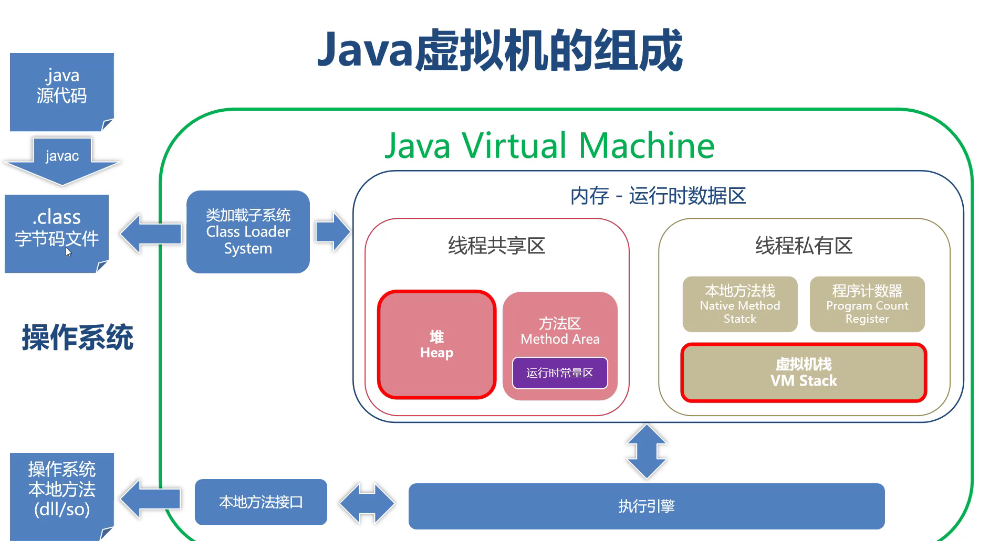
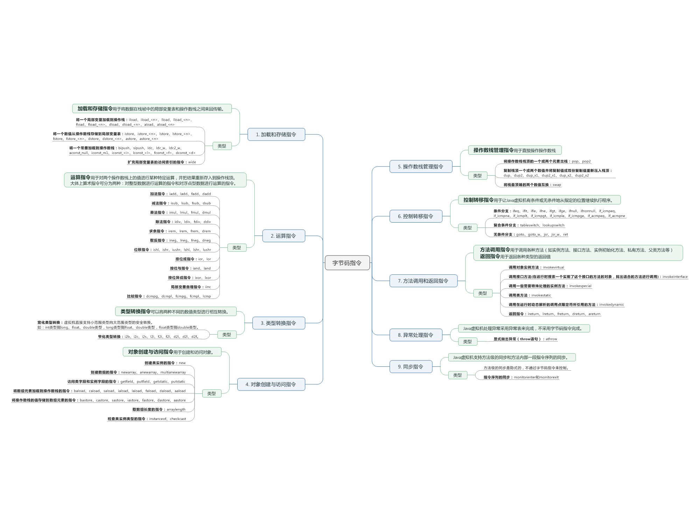
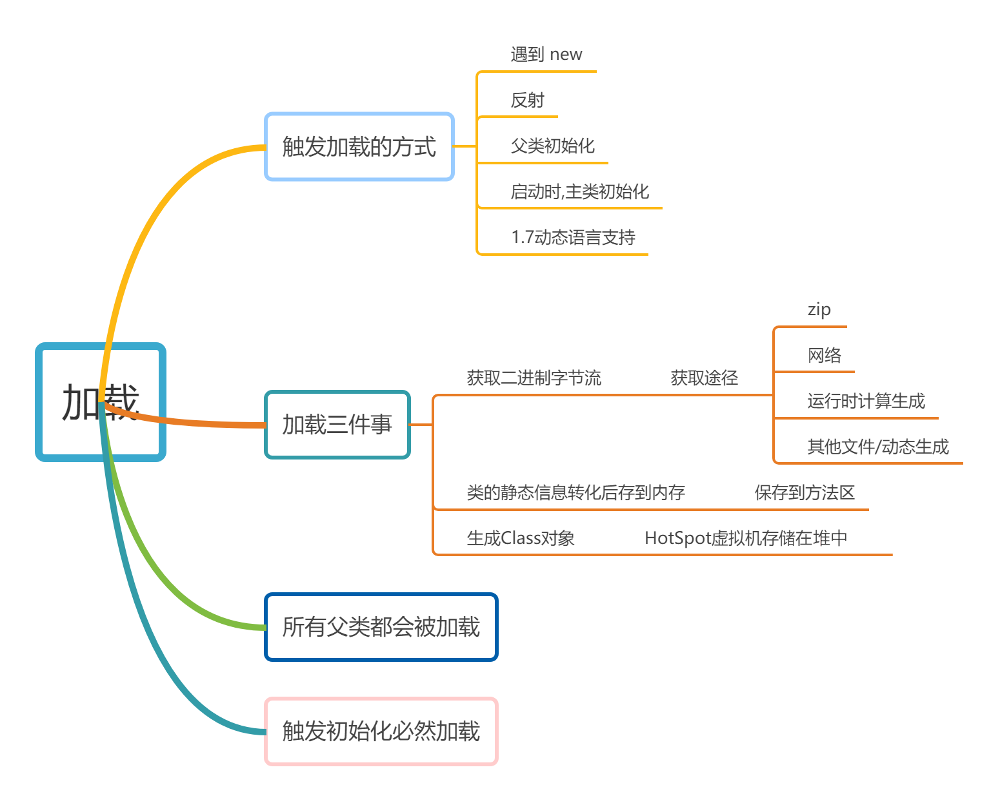

# JVM 

## JVM入门
###JVM发展历史
###
## 字节码
###字节码组成结构：字节码包含哪些信息
```yaml
    １．魔数【１－４】　：区分文件类型的依据　[CAFE BABE]
    ２．文件版本：
        【５－６】：次要版本号，从java5 =31开始，每个大版本递增＋１
        【７－８】：主要版本号，java5=49开始，每个大版本递增＋１
　       字节码版本高于JVM版本时，会抛出UnsupportedClassVersionError
    字节码查看插件：ＪClasslib
    ３．常量池:
        字面量：
            字符串
            final修饰的数值
        符号引用：
            类和接口的权限定名
            字段名称和描述符：整型［Ｉ］，引用类型［Ｌ］
            方法名称和描述符：V-返回void
        常量池类型数据表：    

    ４．访问标志
          访问接口分别类属于：
              类
              字段：或者成为成员变量、属性＼类变量
              方法
          保存类／属性／方法的访问信息：
              是类还是接口
              是否是public
              是否是abstract
              是否final修饰
              表示是否由用户代码产生
              ......
              
    ５．类／父类索引与接口索引集合：确定当前类的继承与实现关系
        　当前类的权限定名
          父类的全限定名
          接口的全限定名
    ６．字段表集合:描述接口或类中声明的字段
          类变量：staic修饰的变量
          实例变量
    ７．方法表集合：描述接口或者类的实例方法和静态方法
    ８．属性表集合：为类、属性，方法提供更为详细的辅助信息
```
###字节码指令：字节码能做哪些事情
   
    字节码指令是包含在字节码的指令
    字节码指令将源码编译时由编译器生成保存在Method描述中
    字节码指令与平台无关，运行时ＪＶＭ读取翻译为各平台底层指令
    字节码指令总数不超过256个
##字节码指令分类
```shell script
    １．加载与存储指令
    ２．控制转移指令
    ３．运算指令
    ４．方法调用与返回指令
    ５．类型转换指令
    ６．同步指令
    ７．对象创建和访问指令
    ８．异常处理指令
    ９．操作数栈管理指令
```


参考：https://www.cnblogs.com/noteless/p/9556928.html#0
## 类加载器
### 类加载子系统
    类加载子系统负责从文件或者网络加载Class字节流
    类加载子系统会读取字节码中的信息，运行时存储到ＪVM内存
    任何Class要被类加载子系统加载，都要符合字节码规范
####　类加载过程－加载阶段
    读取二进制流
    解析字节码二进制流的静态数据转换为运行时ＪＶＭ方法区数据
    生成java.lang.Class对象，放入堆中，作为方法区的访问入口
    在加载类过程中，必然会触发父类加载
####　Class实例何时创建
    1- new 实例化　: A a = new A()
    2- 反射　Class classA = Class.forName("com.it.A")
    3- 子类加载时父类同时被加载
    4- JVM启动时，包含main 方法的主类
    ５- jdk1.7的动态语言支持
    
####　类加载过程－链接Linking阶段
又可以细分为如下三个阶段：
    
    验证：确保字节码符合虚拟机要求
    准备：为字段赋予初始值
    解析：符号引用转换为直接引用(将字节码的静态字面关联转换为ＪVM内存中的动态指针关联)
    
    验证
    
    确保符合虚拟机要求
        因为可以是任何途径生成,所以必须校验
        从JAVA7后,校验规范订版
            文件格式校验
                CAFEBABE
                版本号是否匹配
                ...
                
            元数据匹配,语义分析
                是否有父类
                是否继承了final修饰的类
            ...
            
            字节码验证,数据流与控制流分析
                类型转换是否有效
                无法执行到return?
            
            符号引用
                通过全限定名是否能找到对应的类
                    ClassNotFoundException
                通过全限定名能否找到对应的方法
                    NoSuchMethodError
            注意,这里只是检查,目标Class对象不一定已被加载到内存中,符号引用是由字节码规定
            验证后进入方法区,之后不再操作字节流,加载与验证时交替进行的
    准备
        为类变量赋予初始值
        初始值有表
        对于final修饰的常量保存到字节码中写死啦
    解析    
        同一个符号与内存中的地址建立指针关联,解析是建立在符号引用后进行的
            类解析
            字段解析
            方法解析
            接口方法解析
## 运行时数据区
##垃圾收集器GC
##虚拟机参数调优
 