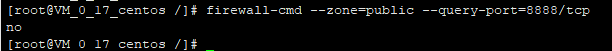

#网络安全
场景：最近总是收到疑似服务器被入侵的告警短信通知。之前就有一次服务器被弄挂了，直接登录不上，后面联系腾讯云技术人员， 做了还原处理，
也就没有太多关注。这次又发出了警告。看了还是有人惦记着我这啥都没有的服务器哇。因此有了如下的学习小结。

## 1、白名单设置

在 /etc/hosts.allow 文件中添加需要放行的白名单
   
    sshd:127.0.0.1:allow
    sshd:127.0.0.2:allow
## 2、黑名单设置
在 /etc/hosts.deny 文件中禁止所有

    sshd:ALL

注意：hosts.allow,hosts.deny 是配合使用的，这里白名单中的IP允许ssh连接。

## 3、开放指定的端口 
例如开放 8888
    
    firewall-cmd --zone=public --query-port=8888/tcp //查看8888 端口是否开放
    firewall-cmd --zone=public --add-port=8888/tcp //开放端口
    firewall-cmd --zone=public --remove-port=8888/tcp //关闭端口
 
 