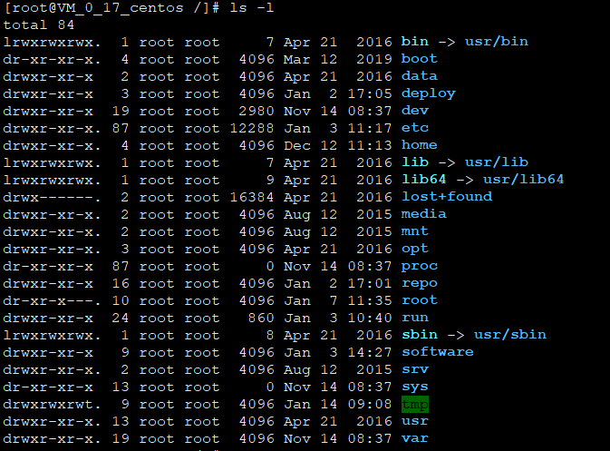

# 文件属性
我们在使用ll 或者 ls -l 查看某个目录下的所有文件时，便可以发现有不同的文件属性。

举个栗子：

我们可以从上图中得出如下一个文件属性的总结图   
 

    第1位表示文件类型,常见的文件类型有如下：
        当为[ d ]则是目录
        当为[ - ]则是文件；
        若是[ l ]则表示为链接文档(link file)；
        若是[ b ]则表示为装置文件里面的可供储存的接口设备(可随机存取装置)；
        若是[ c ]则表示为装置文件里面的串行端口设备，例如键盘、鼠标(一次性读取装置)。
        
    剩下的9位，三个为一组，分别为[rwx],其中，[ r ]代表可读(read)、[ w ]代表可写(write)、[ x ]代表可执行(execute)。
    要注意的是，这三个权限的位置不会改变，如果没有权限，就会出现减号[ - ]而已。
    
    这三组分别是：
    属主权限：    chown
    属组权限：    chgrp
    其它用户权限： 
    
这里有个link file 单独的说明一下：
Linux系统中的链接分为硬链接和软连接(符号链接)两种。

我们通过一个实验来区分一下二者的区别：
    
    touch t1     # 创建一个f1的文件
    ln f1 f2     # 创建f1 的硬链接 f2
    ln -s f1 f3  # 创建f1 的软连接 f3
    
    echo "I am content in f1 file." >> f1
    cat f1
    cat f2
    cat f3
    
显示的结果：
       三个命令都显示：
       
       I am content in f1 file.
接着做如下实验：
       
       ① 删除f1文件，再查看 f2、f3
       
       [root@VM_0_17_centos shell]# rm -f f1
       [root@VM_0_17_centos shell]# cat f2
       I am content in f1 file.
       [root@VM_0_17_centos shell]# cat f3
       cat: f3: No such file or directory
       
       ②删除硬链接f2,查看 f1,f3
       
       [root@VM_0_17_centos shell]# rm -f f2
       [root@VM_0_17_centos shell]# cat f1
       I am tontent in f1 file.
       [root@VM_0_17_centos shell]# cat f3
       I am tontent in f1 file.

       ③删除软链接f3,查看f1,f2
       [root@VM_0_17_centos shell]# rm -f f3
       [root@VM_0_17_centos shell]# cat f1
       I am tontent in f1 file.
       [root@VM_0_17_centos shell]# cat f2
       I am tontent in f1 file.
       
       ④删除f1、f2,看f3
       [root@VM_0_17_centos shell]# rm -f f1 f2
       [root@VM_0_17_centos shell]# cat f3
       cat: f3: No such file or directory
       
通过上述实验可以得出：
    
     1).删除符号连接f3,对f1,f2无影响；
     2).删除硬连接f2，对f1,f3也无影响；
     3).删除原文件f1，对硬连接f2没有影响，导致符号连接f3失效；
     4).同时删除原文件f1,硬连接f2，整个文件会真正的被删除。
     
     PS:硬链接就是重新复制了一样的，而符号链接是一种快捷方式，是对源文件的一种引用。源文件丢失了，符号链接肯定也就不能起作用了。 