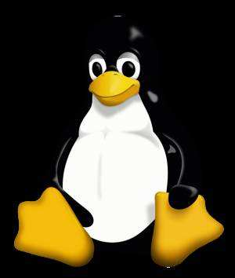

# Linux 初探
记录这个的目的是强制约束自己,能够定期的完成每天规定的任务。并且也是一个系统学习linux的过程。

## linux之父
提到Linux,想必大家都能想到鼎鼎大名的Linus.Torvalds.它便是由Linus在赫尔辛基大学上学时出于个人爱好而编写的。
后面完全开源,参与进来的爱好者也越来越多。也有很多公司或者基金,组织等基于linux内核，编写了很多的衍生版本。(如Ubuntu,centOs,Fedora,Redhat等)

Linux 系统是一个基于 POSIX 和 UNIX 的多用户、多任务、支持多线程和多 CPU 的操作系统。

## linux 吉祥物
linux 的吉祥物叫tux,传闻是当时linus,被公园中的一只企鹅给咬了一下，给了他留下了很深的印象。所以后来在给linux 取吉祥物时，就用了下面这只可爱的企鹅。

### linux 家族
市面上，基于linux内核，发行了很多的版本。目前，linux家族非常的的庞大。

