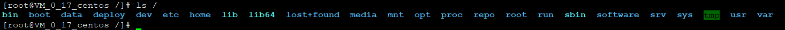

# linux 目录结构
这里的环境为CentOs-7.2

我们一个一个目录的进行分析，他们具体的作用：
    
    bin/        :bin是Binary的缩写, 这个目录存放着最经常使用的命令。
    
    boot        :这里存放的是启动Linux时使用的一些核心文件，包括一些连接文件以及镜像文件。
    
    data        ：个人自定义的数据文件
    
    deploy      ：个人定义的发布程序存放文件 
    
    dev         ：dev是Device(设备)的缩写, 该目录下存放的是Linux的外部设备，在Linux中访问设备的方式和访问文件的方式是相同的。
    
    etc         :存放所有的系统管理所需要的配置文件和子目录。
    
    home        :用户的主目录，在Linux中，每个用户都有一个自己的目录，一般该目录名是以用户的账号命名的。
    
    lib         :存放着系统最基本的动态连接共享库，其作用类似于Windows里的DLL文件。几乎所有的应用程序都需要用到这些共享库。
    
    lib64       :同lib，只不过是专门用于64位系统的
    
    lost+found  ：这个目录一般情况下是空的，当系统非法关机后，这里就存放了一些文件。
    
    media       ：linux系统会自动识别一些设备，例如U盘、光驱等等，当识别后，linux会把识别的设备挂载到这个目录下。
    
    mnt         ：系统提供该目录是为了让用户临时挂载别的文件系统的，我们可以将光驱挂载在/mnt/上，然后进入该目录就可以查看光驱里的内容了。
    
    opt         ：这是给主机额外安装软件所摆放的目录。比如你安装一个ORACLE数据库则就可以放到这个目录下。默认是空的。
    
    proc        ：此目录是一个虚拟的目录，它是系统内存的映射，我们可以通过直接访问这个目录来获取系统信息。
                  这个目录的内容不在硬盘上而是在内存里，我们也可以直接修改里面的某些文件。
                  比如可以通过下面的命令来屏蔽主机的ping命令，使别人无法ping你的机器：
                  echo 1 > /proc/sys/net/ipv4/icmp_echo_ignore_all
    
    repo        ：个人自定义存放maven仓库目录
    
    root        ：该目录为系统管理员，也称作超级权限者的用户主目录。
    
    run         ：是一个临时文件系统，存储系统启动以来的信息。当系统重启时，这个目录下的文件应该被删掉或清除。
                  如果你的系统上有 /var/run 目录，应该让它指向 run。
    
    sbin        ：s就是Super User的意思，这里存放的是系统管理员使用的系统管理程序。
    
    software    ：个人自定义软件安装目录，也可以安装到 /opt 目录下
    
    srv         ：该目录存放一些服务启动之后需要提取的数据。
    
    sys         ：这是linux2.6内核的一个很大的变化。该目录下安装了2.6内核中新出现的一个文件系统 sysfs 。                 
                 sysfs文件系统集成了下面3种文件系统的信息：针对进程信息的proc文件系统、针对设备的devfs文件系统以及针对伪终端的devpts文件系统。
                 该文件系统是内核设备树的一个直观反映。                 
                 当一个内核对象被创建的时候，对应的文件和目录也在内核对象子系统中被创建。
    
    tmp         ：存放临时文件
    
    usr         ：非常重要的目录，用户的很多应用程序和文件都放在这个目录下，类似于windows下的program files目录。
    
    var         ：存放着在不断扩充着的东西，我们习惯将那些经常被修改的目录放在这个目录下。包括各种日志文件。