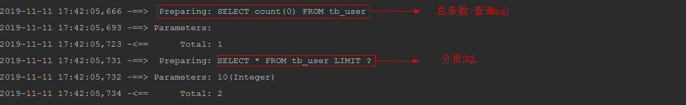

# mybatis常见的几种分页方式

PS：例子中数据库为mysql,如果需要其他的数据库方案，需根据每个数据库的特点进行对应的更改

### 1、利用原生的limit SQL分页
    select * from tb_user limit #{currentPage},#{pageSize}
在 Service 层增加分页的方法，将currentPage、pageSize 这两个分页需要使用到的参数传进来

此分页方法的优点是实现简单，使用原生sql就能实现，不需要借助任何其他工具和插件

### 2、利用拦截器分页

#### 第一步：自定义拦截器

    @Intercepts({@Signature(type=StatementHandler.class,method="prepare",args={Connection.class})})
    public class WySqlInterceptor implements Interceptor {
    
    	private static String dialect = "";	//数据库方言
    	private static String pageSqlId = ""; //mapper.xml中需要拦截的ID(正则匹配)
    
    	
    	public Object intercept(Invocation ivk) throws Throwable {
    		if(ivk.getTarget() instanceof RoutingStatementHandler){
    			RoutingStatementHandler statementHandler = (RoutingStatementHandler)ivk.getTarget();
    			BaseStatementHandler delegate = (BaseStatementHandler) ReflectHelper.getValueByFieldName(statementHandler, "delegate");
    			MappedStatement mappedStatement = (MappedStatement) ReflectHelper.getValueByFieldName(delegate, "mappedStatement");
    
    			if(mappedStatement.getId().matches(pageSqlId)){ //拦截需要分页的SQL
    				BoundSql boundSql = delegate.getBoundSql();
    				Object parameterObject = boundSql.getParameterObject();//分页SQL<select>中parameterType属性对应的实体参数，即Mapper接口中执行分页方法的参数,该参数不得为空
    				if(parameterObject==null){
    					throw new NullPointerException("parameterObject尚未实例化！");
    				}else{
    					Connection connection = (Connection) ivk.getArgs()[0];
    					String sql = boundSql.getSql();
    					String countSql = "select count(0) from (" + sql+ ") as tmp_count"; //记录统计
    					PreparedStatement countStmt = connection.prepareStatement(countSql);
    					BoundSql countBS = new BoundSql(mappedStatement.getConfiguration(),countSql,boundSql.getParameterMappings(),parameterObject);
    					setParameters(countStmt,mappedStatement,countBS,parameterObject);
    					ResultSet rs = countStmt.executeQuery();
    					int count = 0;
    					if (rs.next()) {
    						count = rs.getInt(1);
    					}
    					rs.close();
    					countStmt.close();
    					//System.out.println(count);
    					Page page = null;
    					if(parameterObject instanceof Page){	//参数就是Page实体
    						page = (Page) parameterObject;
    						page.setTotalResult(count);
    					}else{	//参数为某个实体，该实体拥有Page属性
    						Field pageField = ReflectHelper.getFieldByFieldName(parameterObject,"page");
    						if(pageField!=null){
    							page = (Page) ReflectHelper.getValueByFieldName(parameterObject,"page");
    							if(page==null)
    								page = new Page();
    							page.setTotalResult(count);
    							ReflectHelper.setValueByFieldName(parameterObject,"page", page); //通过反射，对实体对象设置分页对象
    						}else{
    							throw new NoSuchFieldException(parameterObject.getClass().getName()+"不存在 page 属性！");
    						}
    					}
    					String pageSql = generatePageSql(sql,page);
    					ReflectHelper.setValueByFieldName(boundSql, "sql", pageSql); //将分页sql语句反射回BoundSql.
    				}
    			}
    		}
    		return ivk.proceed();
    	}
    
    	
    
    
    	public Object plugin(Object arg0) {
    		// TODO Auto-generated method stub
    		return Plugin.wrap(arg0, this);
    	}
    
    	public void setProperties(Properties p) {
    		dialect = p.getProperty("dialect");
    		if (StringUtils.isEmpty(dialect)) {
    			try {
    				throw new PropertyException("dialect property is not found!");
    			} catch (PropertyException e) {
    				// TODO Auto-generated catch block
    				e.printStackTrace();
    			}
    		}
    		pageSqlId = p.getProperty("pageSqlId");
    		if (StringUtils.isEmpty(pageSqlId)) {
    			try {
    				throw new PropertyException("pageSqlId property is not found!");
    			} catch (PropertyException e) {
    
    			}
    		}
    	}
    
    
    	/**
    	 * 根据数据库方言，生成特定的分页sql
    	 * @param sql
    	 * @param page
    	 * @return
    	 */
    	private String generatePageSql(String sql,Page page){
    		if(page!=null && !StringUtils.isEmpty(dialect)){
    			StringBuffer pageSql = new StringBuffer();
    			if("mysql".equals(dialect)){
    				pageSql.append(sql);
    				pageSql.append(" limit "+page.getCurrentResult()+","+page.getShowCount());
    			}else if("oracle".equals(dialect)){
    				pageSql.append("select * from (select tmp_tb.*,ROWNUM row_id from (");
    				pageSql.append(sql);
    				pageSql.append(") as tmp_tb where ROWNUM<=");
    				pageSql.append(page.getCurrentResult()+page.getShowCount());
    				pageSql.append(") where row_id>");
    				pageSql.append(page.getCurrentResult());
    			}
    			return pageSql.toString();
    		}else{
    			return sql;
    		}
    	}
    
    
    	/**
    	 * 对SQL参数(?)设值,参考org.apache.ibatis.executor.parameter.DefaultParameterHandler
    	 * @param ps
    	 * @param mappedStatement
    	 * @param boundSql
    	 * @param parameterObject
    	 * @throws SQLException
    	 */
    	private void setParameters(PreparedStatement ps,MappedStatement mappedStatement,BoundSql boundSql,Object parameterObject) throws SQLException {
    		ErrorContext.instance().activity("setting parameters").object(mappedStatement.getParameterMap().getId());
    		List<ParameterMapping> parameterMappings = boundSql.getParameterMappings();
    		if (parameterMappings != null) {
    			Configuration configuration = mappedStatement.getConfiguration();
    			TypeHandlerRegistry typeHandlerRegistry = configuration.getTypeHandlerRegistry();
    			MetaObject metaObject = parameterObject == null ? null: configuration.newMetaObject(parameterObject);
    			for (int i = 0; i < parameterMappings.size(); i++) {
    				ParameterMapping parameterMapping = parameterMappings.get(i);
    				if (parameterMapping.getMode() != ParameterMode.OUT) {
    					Object value;
    					String propertyName = parameterMapping.getProperty();
    					PropertyTokenizer prop = new PropertyTokenizer(propertyName);
    					if (parameterObject == null) {
    						value = null;
    					} else if (typeHandlerRegistry.hasTypeHandler(parameterObject.getClass())) {
    						value = parameterObject;
    					} else if (boundSql.hasAdditionalParameter(propertyName)) {
    						value = boundSql.getAdditionalParameter(propertyName);
    					} else if (propertyName.startsWith(ForEachSqlNode.ITEM_PREFIX)&& boundSql.hasAdditionalParameter(prop.getName())) {
    						value = boundSql.getAdditionalParameter(prop.getName());
    						if (value != null) {
    							value = configuration.newMetaObject(value).getValue(propertyName.substring(prop.getName().length()));
    						}
    					} else {
    						value = metaObject == null ? null : metaObject.getValue(propertyName);
    					}
    					TypeHandler typeHandler = parameterMapping.getTypeHandler();
    					if (typeHandler == null) {
    						throw new ExecutorException("There was no TypeHandler found for parameter "+ propertyName + " of statement "+ mappedStatement.getId());
    					}
    					typeHandler.setParameter(ps, i + 1, value, parameterMapping.getJdbcType());
    				}
    			}
    		}
    	}
    }

这里 封装了一下反射设置属性值的类：

    @Intercepts({@Signature(type=StatementHandler.class,method="prepare",args={Connection.class})})
    public class WySqlInterceptor implements Interceptor {
    
    	private static String dialect = "";	//数据库方言
    	private static String pageSqlId = ""; //mapper.xml中需要拦截的ID(正则匹配)
    
    	
    	public Object intercept(Invocation ivk) throws Throwable {
    		if(ivk.getTarget() instanceof RoutingStatementHandler){
    			RoutingStatementHandler statementHandler = (RoutingStatementHandler)ivk.getTarget();
    			BaseStatementHandler delegate = (BaseStatementHandler) ReflectHelper.getValueByFieldName(statementHandler, "delegate");
    			MappedStatement mappedStatement = (MappedStatement) ReflectHelper.getValueByFieldName(delegate, "mappedStatement");
    
    			if(mappedStatement.getId().matches(pageSqlId)){ //拦截需要分页的SQL
    				BoundSql boundSql = delegate.getBoundSql();
    				Object parameterObject = boundSql.getParameterObject();//分页SQL<select>中parameterType属性对应的实体参数，即Mapper接口中执行分页方法的参数,该参数不得为空
    				if(parameterObject==null){
    					throw new NullPointerException("parameterObject尚未实例化！");
    				}else{
    					Connection connection = (Connection) ivk.getArgs()[0];
    					String sql = boundSql.getSql();
    					String countSql = "select count(0) from (" + sql+ ") as tmp_count"; //记录统计
    					PreparedStatement countStmt = connection.prepareStatement(countSql);
    					BoundSql countBS = new BoundSql(mappedStatement.getConfiguration(),countSql,boundSql.getParameterMappings(),parameterObject);
    					setParameters(countStmt,mappedStatement,countBS,parameterObject);
    					ResultSet rs = countStmt.executeQuery();
    					int count = 0;
    					if (rs.next()) {
    						count = rs.getInt(1);
    					}
    					rs.close();
    					countStmt.close();
    					//System.out.println(count);
    					Page page = null;
    					if(parameterObject instanceof Page){	//参数就是Page实体
    						page = (Page) parameterObject;
    						page.setTotalResult(count);
    					}else{	//参数为某个实体，该实体拥有Page属性
    						Field pageField = ReflectHelper.getFieldByFieldName(parameterObject,"page");
    						if(pageField!=null){
    							page = (Page) ReflectHelper.getValueByFieldName(parameterObject,"page");
    							if(page==null)
    								page = new Page();
    							page.setTotalResult(count);
    							ReflectHelper.setValueByFieldName(parameterObject,"page", page); //通过反射，对实体对象设置分页对象
    						}else{
    							throw new NoSuchFieldException(parameterObject.getClass().getName()+"不存在 page 属性！");
    						}
    					}
    					String pageSql = generatePageSql(sql,page);
    					ReflectHelper.setValueByFieldName(boundSql, "sql", pageSql); //将分页sql语句反射回BoundSql.
    				}
    			}
    		}
    		return ivk.proceed();
    	}
    
    	
    
    
    	public Object plugin(Object arg0) {
    		// TODO Auto-generated method stub
    		return Plugin.wrap(arg0, this);
    	}
    
    	public void setProperties(Properties p) {
    		dialect = p.getProperty("dialect");
    		if (StringUtils.isEmpty(dialect)) {
    			try {
    				throw new PropertyException("dialect property is not found!");
    			} catch (PropertyException e) {
    				// TODO Auto-generated catch block
    				e.printStackTrace();
    			}
    		}
    		pageSqlId = p.getProperty("pageSqlId");
    		if (StringUtils.isEmpty(pageSqlId)) {
    			try {
    				throw new PropertyException("pageSqlId property is not found!");
    			} catch (PropertyException e) {
    
    			}
    		}
    	}
    
    
    	/**
    	 * 根据数据库方言，生成特定的分页sql
    	 * @param sql
    	 * @param page
    	 * @return
    	 */
    	private String generatePageSql(String sql,Page page){
    		if(page!=null && !StringUtils.isEmpty(dialect)){
    			StringBuffer pageSql = new StringBuffer();
    			if("mysql".equals(dialect)){
    				pageSql.append(sql);
    				pageSql.append(" limit "+page.getCurrentResult()+","+page.getShowCount());
    			}else if("oracle".equals(dialect)){
    				pageSql.append("select * from (select tmp_tb.*,ROWNUM row_id from (");
    				pageSql.append(sql);
    				pageSql.append(") as tmp_tb where ROWNUM<=");
    				pageSql.append(page.getCurrentResult()+page.getShowCount());
    				pageSql.append(") where row_id>");
    				pageSql.append(page.getCurrentResult());
    			}
    			return pageSql.toString();
    		}else{
    			return sql;
    		}
    	}
    
    
    	/**
    	 * 对SQL参数(?)设值,参考org.apache.ibatis.executor.parameter.DefaultParameterHandler
    	 * @param ps
    	 * @param mappedStatement
    	 * @param boundSql
    	 * @param parameterObject
    	 * @throws SQLException
    	 */
    	private void setParameters(PreparedStatement ps,MappedStatement mappedStatement,BoundSql boundSql,Object parameterObject) throws SQLException {
    		ErrorContext.instance().activity("setting parameters").object(mappedStatement.getParameterMap().getId());
    		List<ParameterMapping> parameterMappings = boundSql.getParameterMappings();
    		if (parameterMappings != null) {
    			Configuration configuration = mappedStatement.getConfiguration();
    			TypeHandlerRegistry typeHandlerRegistry = configuration.getTypeHandlerRegistry();
    			MetaObject metaObject = parameterObject == null ? null: configuration.newMetaObject(parameterObject);
    			for (int i = 0; i < parameterMappings.size(); i++) {
    				ParameterMapping parameterMapping = parameterMappings.get(i);
    				if (parameterMapping.getMode() != ParameterMode.OUT) {
    					Object value;
    					String propertyName = parameterMapping.getProperty();
    					PropertyTokenizer prop = new PropertyTokenizer(propertyName);
    					if (parameterObject == null) {
    						value = null;
    					} else if (typeHandlerRegistry.hasTypeHandler(parameterObject.getClass())) {
    						value = parameterObject;
    					} else if (boundSql.hasAdditionalParameter(propertyName)) {
    						value = boundSql.getAdditionalParameter(propertyName);
    					} else if (propertyName.startsWith(ForEachSqlNode.ITEM_PREFIX)&& boundSql.hasAdditionalParameter(prop.getName())) {
    						value = boundSql.getAdditionalParameter(prop.getName());
    						if (value != null) {
    							value = configuration.newMetaObject(value).getValue(propertyName.substring(prop.getName().length()));
    						}
    					} else {
    						value = metaObject == null ? null : metaObject.getValue(propertyName);
    					}
    					TypeHandler typeHandler = parameterMapping.getTypeHandler();
    					if (typeHandler == null) {
    						throw new ExecutorException("There was no TypeHandler found for parameter "+ propertyName + " of statement "+ mappedStatement.getId());
    					}
    					typeHandler.setParameter(ps, i + 1, value, parameterMapping.getJdbcType());
    				}
    			}
    		}
    	}
    }

#### 第二步：在mybatis.xml 中配置拦截器
    
    <plugins>
    	<plugin interceptor="com.everwing.coreservice.wy.dao.plugins.WySqlInterceptor">
    		<property name="dialect" value="mysql" />
    		<property name="pageSqlId" value=".*listPage.*" />
    	</plugin>
    </plugins>

#### 第三步：Service 分页方法 以listPage*开头，并且用于查询条件的实体类需要包含一个Page分页的对象

例如：

     List<AccountFeeBaseDto> accountFeeBaseDtos = accountFeeMapper.listPageAccountAllFee(feePageDto);
其中 feePageDto 就包含Page 对象
 
    public class AccountFeePageDto implements Serializable {
    /**
     * 房号
     */
    private String  houseCode;
    /**
     * 账户类型
     */
    private String acountType;
    /**
     * 查询年份
     */
    private String year;
    /**
     * 分页对象
     */
    private Page page;
    }
    
### 3、利用PageHelper插件分页

① 添加 pageHelper 依赖

    <dependency>
    	<groupId>com.github.pagehelper</groupId>
    	<artifactId>pagehelper-spring-boot-starter</artifactId>
   		<version>1.2.12</version>
    </dependency>

② yaml文件中添加 pageHelper的配置项

    pagehelper:
      helper-dialect: mysql
      offset-as-page-num: true
      row-bounds-with-count: true
      page-size-zero: true
      reasonable: false
      support-methods-arguments: true
      params: count=countSql

③ 使用PageHelper 进行分页查询

我这里只做了一个单元测试

    @SpringBootTest
    public class UserMapperTest {
    
    @Autowired
    private UserMapper userMapper;
    
    @Test
    public void listUser(){
	    PageHelper.startPage(1,10);
	    Page<User> users = userMapper.listUser();
	    }
    } 

通过打印出mybatis 的执行SQL,可以看到使用了物理分页:

# mybatis分页原理
TODO[先占个位子，后面进行分析]