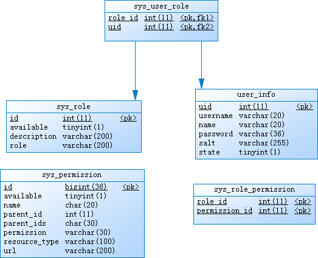

# 根据用户ID或者用户名，查询该用户拥有的权限

#### 用户信息表 ：user_info(uid,username,name,password,salt,state)
#### 角色信息表：sys_role(id,available,description,role)
#### 用户角色表：sys_user_role(role_id,uid)
#### 权限信息表：sys_permission(id,available,name,parent_id,parent_ids,permission,resource_type,url)
#### 角色权限表：sys_role_permission(role_id,permission_id)

根据用户名或者用户ID查询该用户拥有的权限

分析：

 第一步、该用户是什么角色

 第二步、该角色 具有哪些权限

 第三步、该用户具有哪些权限

    SELECT * from sys_permission where id in(
    	SELECT permission_id from sys_role_permission where role_id in(
    		SELECT role_id from sys_user_role where uid in (
    		SELECT uid FROM user_info where username ='admin' or uid = 'admin'

    	)
     )
    )

