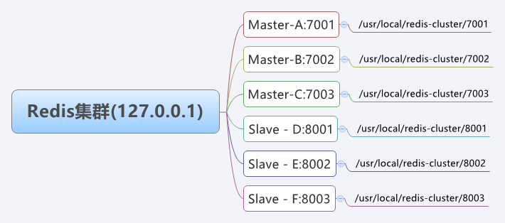

###### 参考：

```
https://mp.weixin.qq.com/s/EfK-FHBFFz0dTv6VDqVBiQ
```

######  前期准备：官网下载最新版本


```
wget  http://download.redis.io/releases/redis-5.0.8.tar.gz
```

###### 解压

```
tar -zxvf redis-5.0.8.tar.gz
```
##### 设置 Redis 环境变量，目的是在任意目录下都可使用【这一步不设置也可以，但就需要到redis安装目录下去执行命令】
vi /etc/profile
增加如下内容：

    export REDIS_HOME=/software/redis-5.0.8
    export PATH=$PATH:$REDIS_HOME/bin

###### 正式搭建

集群的创建方式有两种：手动传创建和自动创建。这里两种都尝试一下：

手动创建集群：

根据Redis cluster 内部故障转移原理，Redis至少需要三个主节点，而每个主节点至少需要一个从节点。因此搭建一个集群，至少需要6个节点。三主三从部署到不用的机器s

这里由于机器有限，我们采用在一台机器上，使用不同端口号开启不同实例的方式，搭建一个伪集群.
这里做了如下端口的规划使用：



根据上述的规划，在指定目录下创建对应文件夹
    
    cd 
    mkdir redis-cluster
    mkdir -p {7001 7002 7003 8001 8002 8003}
    cd redis-cluster && mkdir data

修改redis.conf,文件末尾增加如下内容：

    # 设置当前节点主机地址--这里实际生产时改为自己主机的ip即可 
    bind 127.0.0.1  
    # 设置客户端连接监听端口                              
    port 7001                
    # 设置 Redis 实例 pid 文件                    
    pidfile /var/run/redis_7001.pid
    # 以守护进程运行 Redis 实例             
    daemonize yes 
    # 启用集群模式                            
    cluster-enabled yes     
    # 设置当前节点连接超时毫秒数               
    cluster-node-timeout 15000 
    #集群配置文件名            
    cluster-config-file nodes-7001.conf  
    # 数据存储位置
    dir /usr/local/redis-cluster/data/ 
    
    注意：这里的# 注释内容单独一行，不要写在参数的后面，测试的时候写在参数后，启动报错
   
接着将redis.conf 文件分别拷贝到A、B、C、D、E、F 6个节点目录下,然后将每个redis.conf改为自己对应的端口号。

    cd /usr/local/redis-5.0.3
    cp redis.conf /usr/local/redis-cluster/7001 
    cp redis.conf /usr/local/redis-cluster/7002
    cp redis.conf /usr/local/redis-cluster/7003 
    cp redis.conf /usr/local/redis-cluster/8001
    cp redis.conf /usr/local/redis-cluster/8002 
    cp redis.conf /usr/local/redis-cluster/8003 
    
启动着6个节点
    
    redis-server /usr/local/redis-cluster/7001/redis.conf
    redis-server /usr/local/redis-cluster/7002/redis.conf
    redis-server /usr/local/redis-cluster/7003/redis.conf
    redis-server /usr/local/redis-cluster/8001/redis.conf
    redis-server /usr/local/redis-cluster/8002/redis.conf
    redis-server /usr/local/redis-cluster/8003/redis.conf
启动好后，查看是否运行正常：

      [root@VM_0_17_centos redis-cluster]# ps -ef |grep redis
      root     10953     1  0 10:23 ?        00:00:00 redis-server 127.0.0.1:7001 [cluster]
      root     10977     1  0 10:23 ?        00:00:00 redis-server 127.0.0.1:7002 [cluster]
      root     10992     1  0 10:23 ?        00:00:00 redis-server 127.0.0.1:7003 [cluster]
      root     11002     1  0 10:23 ?        00:00:00 redis-server 127.0.0.1:8001 [cluster]
      root     11014     1  0 10:23 ?        00:00:00 redis-server 127.0.0.1:8002 [cluster]
      root     11023     1  0 10:23 ?        00:00:00 redis-server 127.0.0.1:8003 [cluster]
      root     11044  9015  0 10:24 pts/1    00:00:00 grep --color=auto redis
如上图输出，则说明6个节点启动正常

####  节点握手
虽然上面 6 个节点都启用了群集支持，但默认情况下它们是不相互信任或者说没有联系的。节点握手就是在各个节点之间创建链接（每个节点与其他节点相连），形成一个完整的网格，即集群。

节点握手的命令如下：

    cluster meet ip port

但为了创建群集，不需要发送形成完整网格所需的所有 cluster meet 命令。只要能发送足够的cluster meet消息，可以让每个节点都可以通过一系列已知节点到达每个其他节点，缺失的链接将被自动创建。

例如，如果我们通过cluster meet将节点 A 与节点 B 连接起来，并将 B 与 C 连接起来，则 A 和 C 会自己找到握手方式并创建链接。

我们的创建的 6 个节点可以通过 redis-cli 连接到 A 节点执行如下五组命令完成握手，生产环境需要将 IP 127.0.0.1替换成外网 IP。

    [root@VM_0_17_centos data]# redis-cli -p 7001
    127.0.0.1:7001> cluster meet 127.0.0.1 7002
    OK
    127.0.0.1:7001> cluster meet 127.0.0.1 7003
    OK
    127.0.0.1:7001> cluster meet 127.0.0.1 8001
    OK
    127.0.0.1:7001> cluster meet 127.0.0.1 8002
    OK
    127.0.0.1:7001> cluster meet 127.0.0.1 8003
    
 接下来可以通过 cluster nodes 命令查看节点之间 的链接状态。随机找A节点，输出结果如下所示。
     
     127.0.0.1:7001> cluster nodes
     0ae07ac8e2289d17819797d48cb96811012fb7c3 127.0.0.1:7001@17001 myself,master - 0 1586831730000 1 connected
     46cf1ee8d49081e51eedbc8bdaab7b8e3c0afffe 127.0.0.1:8001@18001 master - 0 1586831730894 3 connected
     a728ffbe28072b7222ba6b34c4b5aa6c74e039b0 127.0.0.1:7003@17003 master - 0 1586831728890 2 connected
     2a8a4ce8e13cb92f8832f40efeb023e04538e00f 127.0.0.1:8003@18003 master - 0 1586831729892 5 connected
     13eb3a30205b7ec1952235865694b02097d89b0d 127.0.0.1:8002@18002 master - 0 1586831729000 4 connected
     f65a66fb12b3a594e9b0ac1c42d04d1daae8b3c6 127.0.0.1:7002@17002 master - 0 1586831728000 0 connected
可以发现，节点握手完成。

#### 分配槽位
此时 Redis 集群还并没有处于上线状态，可以在任意一节点上执行 cluster info 命令来查看目前集群的运行状态。

    [root127.0.0.1:7001> cluster info
         cluster_state:fail
         ......
上面输出cluster_state:fail表示当前集群处于下线状态。因为只有给集群中所有主节点分配好槽位（即哈希槽slot，本文第一小节有提及）集群才能上线。

分配槽位的命令如下：

    cluster addslots slot [slot ...]
根据预先规划，这一步需要使用 cluster addslots 命令手动将 16384 个哈希槽大致均等分配给主节点 A、B、C。

    [root@VM_0_17_centos data]# redis-cli -p 7001 cluster addslots {0..5460}
    OK
    [root@VM_0_17_centos data]# redis-cli -p 7002 cluster addslots {5461..10922}
    OK
    [root@VM_0_17_centos data]# redis-cli -p 7003 cluster addslots {10923..16383}
    OK


上述命令执行完后，再来查看一下集群目前的状态：
    
    [root@VM_0_17_centos data]# redis-cli -p 7002 cluster info
    cluster_state:ok
    cluster_slots_assigned:16384
    cluster_slots_ok:16384
    cluster_slots_pfail:0
    cluster_slots_fail:0
    cluster_known_nodes:6
    cluster_size:3
    cluster_current_epoch:5
    cluster_my_epoch:0
    cluster_stats_messages_ping_sent:190
    cluster_stats_messages_pong_sent:192
    cluster_stats_messages_meet_sent:1
    cluster_stats_messages_sent:383
    cluster_stats_messages_ping_received:188
    cluster_stats_messages_pong_received:191
    cluster_stats_messages_meet_received:4
    cluster_stats_messages_received:383
如上输出cluster_state:ok证明 Redis 集群成功上线。

主从复制
Redis 集群成功上线，不过还没有给主节点指定从节点，此时如果有一个节点故障，那么整个集群也就挂了，也就无法实现高可用。详细了解点这里：Redis主从复制以及主从复制原理

集群中需要使用 cluster replicate 命令手动给从节点配置主节点。

集群复制命令如下：

    cluster replicate node-id
集群中各个节点的node-id可以用cluster nodes命令查看，如下输出0ae07ac8e2289d17819797d48cb96811012fb7c3即是主节点 A 的node-id.
    
    [root@VM_0_17_centos data]# redis-cli -p 7002 cluster nodes
    a728ffbe28072b7222ba6b34c4b5aa6c74e039b0 127.0.0.1:7003@17003 master - 0 1586831899016 2 connected 10923-16383
    2a8a4ce8e13cb92f8832f40efeb023e04538e00f 127.0.0.1:8003@18003 master - 0 1586831900020 5 connected
    13eb3a30205b7ec1952235865694b02097d89b0d 127.0.0.1:8002@18002 master - 0 1586831898014 4 connected
    0ae07ac8e2289d17819797d48cb96811012fb7c3 127.0.0.1:7001@17001 master - 0 1586831897000 1 connected 0-5460
    f65a66fb12b3a594e9b0ac1c42d04d1daae8b3c6 127.0.0.1:7002@17002 myself,master - 0 1586831898000 0 connected 5461-10922
    46cf1ee8d49081e51eedbc8bdaab7b8e3c0afffe 127.0.0.1:8001@18001 master - 0 1586831896000 3 connected
    
根据预先规划，A主D从；B主E从；C主F从。执行如下三组命令分别为从节点 D、E、F 指定其主节点，使群集可以自动完成主从复制。
   
    [root@VM_0_17_centos data]# redis-cli -p 8001 cluster replicate 0ae07ac8e2289d17819797d48cb96811012fb7c3
    OK
    [root@VM_0_17_centos data]# redis-cli -p 8002 cluster replicate  f65a66fb12b3a594e9b0ac1c42d04d1daae8b3c6
    OK
    [root@VM_0_17_centos data]# redis-cli -p 8003 cluster replicate a728ffbe28072b7222ba6b34c4b5aa6c74e039b0
    OK
至此，我们就成功搭建好了一个三主三从的集群，再查看一下集群状态：
    
    [root@VM_0_17_centos data]# redis-cli -p 7002 cluster nodes
    a728ffbe28072b7222ba6b34c4b5aa6c74e039b0 127.0.0.1:7003@17003 master - 0 1586832027364 2 connected 10923-16383
    2a8a4ce8e13cb92f8832f40efeb023e04538e00f 127.0.0.1:8003@18003 slave a728ffbe28072b7222ba6b34c4b5aa6c74e039b0 0 1586832030373 5 connected
    13eb3a30205b7ec1952235865694b02097d89b0d 127.0.0.1:8002@18002 slave f65a66fb12b3a594e9b0ac1c42d04d1daae8b3c6 0 1586832028367 4 connected
    0ae07ac8e2289d17819797d48cb96811012fb7c3 127.0.0.1:7001@17001 master - 0 1586832029371 1 connected 0-5460
    f65a66fb12b3a594e9b0ac1c42d04d1daae8b3c6 127.0.0.1:7002@17002 myself,master - 0 1586832029000 0 connected 5461-10922
    46cf1ee8d49081e51eedbc8bdaab7b8e3c0afffe 127.0.0.1:8001@18001 slave 0ae07ac8e2289d17819797d48cb96811012fb7c3 0 1586832028000 3 connected

---
自动方式创建集群：
Redis 3.0 版本之后官方发布了一个集群管理工具 redis-trib.rb，集成在 Redis 源码包的src目录下。其封装了 Redis 提供的集群命令，使用简单、便捷。

不过 redis-trib.rb 是 Redis 作者使用 Ruby 语言开发的，故使用该工具之前还需要先在机器上安装 Ruby 环境。后面作者可能意识到这个问题，Redis 5.0 版本开始便把这个工具集成到 redis-cli 中，以--cluster参数提供使用，其中create命令可以用来创建集群。

启动节点
使用集群管理工具搭建集群之前，也是需要先把各个节点启动起来的。节点的启动方式请参见本文「手动方式创建」-「启动节点」一节，此处不再赘述。

集群管理工具搭建
如果您安装的 Redis 是 3.x 和 4.x 的版本可以使用 redis-trib.rb 搭建，不过之前需要安装 Ruby 环境。

先使用 yum 安装 Ruby 环境以及其他依赖项。

yum -y install ruby ruby-devel rubygems rpm-build
确认安装版本。

    [root@localhost redis-cluster]# ruby -v
    ruby 2.0.0p648 (2015-12-16) [x86_64-linux]
再使用 redis-trib.rb 脚本搭建集群，具体命令如下所示。

    /usr/local/redis-5.0.8/src/redis-trib.rb create --replicas 1 127.0.0.1:7001 127.0.0.1:7002 127.0.0.1:7003 127.0.0.1:8001 127.0.0.1:8002 127.0.0.1:8003
不过，本文实验环境使用的 Redis 版本是 5.0.8，所以我可以直接使用redis-cli --cluster create命令搭建，具体命令如下所示。

    redis-cli --cluster  create 127.0.0.1:7001 127.0.0.1:7002 127.0.0.1:7003 127.0.0.1:8001 127.0.0.1:8002 127.0.0.1:8003 --cluster-replicas 1
主节点在前，从节点在后。其中--cluster-replicas参数用来指定一个主节点带有的从节点个数，如上--cluster-replicas 1即表示 1 个主节点有 1 个从节点。