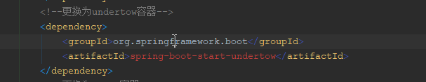

# SpringBoot更改内置容器为undertow
#### 记录一个搞笑的问题！！！

Springboot-undertow 在使用的时候，死活切换不了内置的容器，后来发现pom.xml中的依赖写错了【starter 少了er】！！！弄了一上午，细心哇 ....

#### 错误写法：

#### 正确写法：

借此记录总结一下：

1、尽量不要手敲，能够从maven 仓库获取复制的，直接复制，减少错误概率

2、出了问题多对比可以的例子，快速定位到问题
